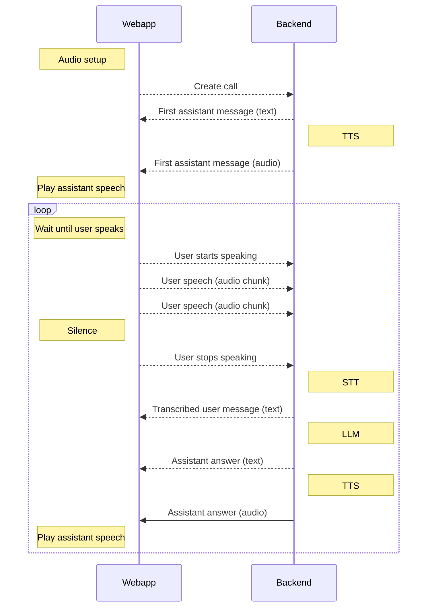

# 🎤 Micdrop

Micdrop is a set of packages that simplify voice conversations with AI systems. It handles all the complexities of microphone input, speaker output, and network communication, allowing developers to focus on their AI implementation.

## 🤔 Why Micdrop?

While real-time multimodal models (voice-to-voice) offer impressive capabilities, they often come with limitations in terms of customization and cost. Micdrop takes a different approach by:

- 🎯 Allowing you to choose the best-in-class API for each component:
  - Select specific voices from TTS providers
  - Use different LLMs optimized for your use case
  - Pick STT engines suited for specific languages/accents
- 💰 Reducing costs by letting you:
  - Use more cost-effective API providers
  - Mix open source and commercial solutions
  - Control exactly when APIs are called
- 🔧 Providing granular control over the conversation flow
- 🌐 Supporting a wider range of languages and voices through specialized providers

This modular approach gives you the flexibility to build voice applications that are both powerful and cost-effective.

## 🌟 Features

- 🎙️ Microphone handling and audio streaming
  - Voice Activity Detection (VAD) to optimize audio transmission
  - Configurable silence detection
- 🔊 Advanced audio playback with:
  - Streaming support via MediaSource
  - Pause/resume capabilities
  - Volume control
  - Device selection
- 🌐 WebSocket communication
- 🔌 Framework-agnostic AI integration
- 🛠️ Bring your own AI components:
  - Large Language Models (LLM)
  - Text-to-Speech (TTS) with streaming support
  - Speech-to-Text (STT)

## 📦 Packages

This monorepo contains the following packages:

### Core Packages

- [`@micdrop/client`](./packages/client/README.md) - Browser library handling microphone input, audio playback, and real-time communication
- [`@micdrop/server`](./packages/server/README.md) - Server implementation for audio streaming and AI integration orchestration

### Demo Applications

- [`@micdrop/demo-client`](./packages/demo-client/README.md) - Example web application with React.
- [`@micdrop/demo-server`](./packages/demo-server/README.md) - Example server with fastify.

## 🔌 Protocol

Micdrop uses a simple custom protocol over WebSocket for real-time communication between the client and server.

### Why WebSocket?

While WebRTC is a powerful protocol for real-time communication, Micdrop uses a simple custom protocol over WebSocket for several reasons:

- 🎯 **Focused on our use case**: WebRTC is designed for peer-to-peer communication, with features we don't need. Our client-server architecture is simpler.

- 🔇 **Efficient audio transmission**: By using Voice Activity Detection (VAD) on the client side, we only send audio when the user is actually speaking. This reduces bandwidth usage and processing load compared to continuous streaming.

- 💡 **Simple implementation**: WebSocket provides a straightforward, reliable way to send both text and binary data. The protocol is easy to implement and debug on both client and server.

- 🔄 **Bidirectional communication**: WebSocket allows for real-time bidirectional messaging, which is perfect for our text and audio exchange needs.

- 🛠️ **Custom protocol control**: Our simple protocol lets us optimize exactly how and when audio/text messages are sent, without the overhead of WebRTC's full feature set.

This approach gives us the real-time capabilities we need while keeping the implementation lean and efficient.

## 🧪 Development

For detailed development instructions, including how to build, test, and publish packages, please see [DEVELOPMENT.md](DEVELOPMENT.md).

## 📄 License

MIT License - see the [LICENSE](LICENSE) file for details

## Author

Originally developed for [Raconte.ai](https://www.raconte.ai)

by [Lonestone](https://www.lonestone.io) ([GitHub](https://github.com/lonestone))
