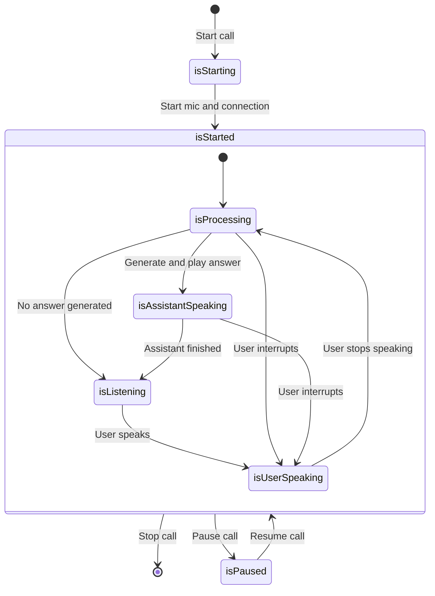

# Call State

Monitor and react to real-time conversation state changes during voice calls.

## `StateChange` Event

The `StateChange` event is emitted whenever the client state changes. It provides both the current state and the previous state for comparison:

```typescript
Micdrop.on(
  'StateChange',
  (currentState: MicdropState, previousState: MicdropState) => {
    // Handle state change
  }
)
```

See [MicdropClient](./utility-classes/micdrop-client#state) for more details.

## State Properties

The `MicdropState` object contains these properties:

| Property              | Type                  | Description                          |
| --------------------- | --------------------- | ------------------------------------ |
| `isStarting`          | `boolean`             | Call is connecting and starting      |
| `isStarted`           | `boolean`             | Call is active and ready             |
| `isReconnecting`      | `boolean`             | Call is attempting to reconnect      |
| `isPaused`            | `boolean`             | Call is paused (no audio processing) |
| `isListening`         | `boolean`             | Ready to detect user speech          |
| `isProcessing`        | `boolean`             | Processing user input on server      |
| `isUserSpeaking`      | `boolean`             | User voice detected                  |
| `isAssistantSpeaking` | `boolean`             | Assistant audio playing              |
| `isMicStarted`        | `boolean`             | Microphone is active                 |
| `isMicMuted`          | `boolean`             | Microphone is muted                  |
| `micDeviceId`         | `string`              | Active microphone device ID          |
| `speakerDeviceId`     | `string`              | Active speaker device ID             |
| `micDevices`          | `MediaDeviceInfo[]`   | Available microphones                |
| `speakerDevices`      | `MediaDeviceInfo[]`   | Available speakers                   |
| `conversation`        | `MicdropConversation` | Message history                      |
| `error`               | `MicdropClientError`  | Current error if any                 |

## State Diagram



**Notes:**

- User can interrupt the assistant at any time by speaking during the `isProcessing` or `isAssistantSpeaking` states. This allows for natural conversation flow. To prevent interruptions during assistant responses, use the [`disableInterruption` setting](./utility-classes/micdrop-client#options).
- When `isPaused` is true, `isStarted` stays true.
- When `isReconnecting` is true, `isStarted` stays true.
- `isMicStarted` becomes true when we start the mic (with `Micdrop.startMic`) or start the call (with `Micdrop.start`).

## Starting a Call

```typescript
Micdrop.on('StateChange', (state, prevState) => {
  if (state.isStarting && !prevState.isStarting) {
    console.log('🔄 Connecting...')
  }

  if (state.isStarted && !prevState.isStarted) {
    console.log('✅ Connected and ready!')
  }

  if (state.isReconnecting && !prevState.isReconnecting) {
    console.log('🔄 Connection lost, reconnecting...')
  }
})
```

## Conversation Flow

The typical conversation flow follows this pattern:

```typescript
Micdrop.on('StateChange', (state, prevState) => {
  // 1. Listening for user input
  if (state.isListening && !prevState.isListening) {
    console.log('🎤 Listening...')
    // Show listening indicator
  }

  // 2. User starts speaking
  if (state.isUserSpeaking && !prevState.isUserSpeaking) {
    console.log('🗣️ User speaking...')
    // Show speaking indicator
  }

  // 3. Processing user input
  if (state.isProcessing && !prevState.isProcessing) {
    console.log('⚡ Processing...')
    // Show processing indicator
  }

  // 4. Assistant responds
  if (state.isAssistantSpeaking && !prevState.isAssistantSpeaking) {
    console.log('🤖 Assistant speaking...')
    // Show assistant speaking indicator
  }
})
```

## With React

For React applications, use the `useMicdropState` hook to automatically subscribe to state changes.

First, install the React package:

```bash
npm install @micdrop/react
```

Then use the hook:

```tsx
import { useMicdropState } from '@micdrop/react'

function CallInterface() {
  const {
    isStarting,
    isStarted,
    isReconnecting,
    isListening,
    isUserSpeaking,
    isProcessing,
    isAssistantSpeaking,
    isPaused,
  } = useMicdropState()

  return (
    <div className="call-interface">
      {isStarting && <div className="status starting">Starting...</div>}
      {isStarted && <div className="status started">Started</div>}
      {isReconnecting && (
        <div className="status reconnecting">🔄 Reconnecting...</div>
      )}
      {isPaused && <div className="status paused">⏸️ Call paused</div>}
      {isMuted && <div className="status muted">⏸️ Call muted</div>}
      {isListening && <div className="status listening">🎤 Listening</div>}
      {isUserSpeaking && (
        <div className="status user-speaking">🗣️ You're speaking</div>
      )}
      {isProcessing && <div className="status processing">⚡ Processing</div>}
      {isAssistantSpeaking && (
        <div className="status assistant-speaking">🤖 Assistant speaking</div>
      )}
    </div>
  )
}
```

More information about hooks in the [React hooks](./react-hooks) section.
