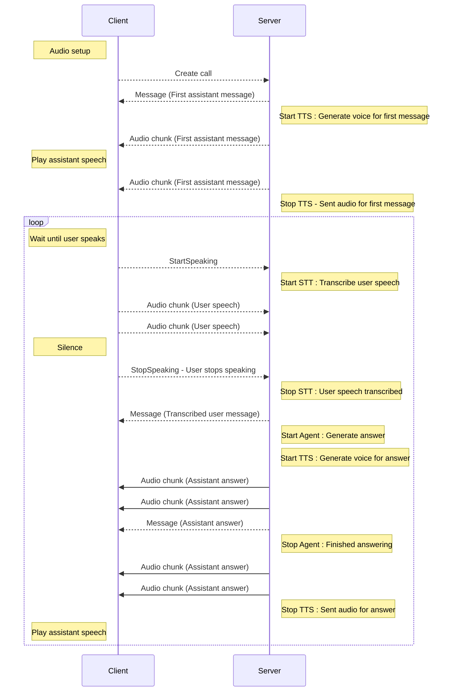

# Micdrop server protocol

## WebSocket Protocol

Micdrop uses a simple custom protocol over WebSocket for real-time communication between the client and server.

## Why WebSocket?

While WebRTC is a powerful protocol for real-time communication, Micdrop uses a simple custom protocol over WebSocket for several reasons:

- 🎯 **Focused on our use case**: WebRTC is designed for peer-to-peer communication, with features we don't need. Our client-server architecture is simpler.

- 🔇 **Efficient audio transmission**: By using Voice Activity Detection (VAD) on the client side, we only send audio when the user is actually speaking. This reduces bandwidth usage and processing load compared to continuous streaming.

- 💡 **Simple implementation**: WebSocket provides a straightforward, reliable way to send both text and binary data. The protocol is easy to implement and debug on both client and server.

- 🔄 **Bidirectional communication**: WebSocket allows for real-time bidirectional messaging, which is perfect for our text and audio exchange needs.

- 🛠️ **Custom protocol control**: Our simple protocol lets us optimize exactly how and when audio/text messages are sent, without the overhead of WebRTC's full feature set.

This approach gives us the real-time capabilities we need while keeping the implementation lean and efficient.

## Client Commands

The client can send the following commands to the server:

- `MicdropClientCommands.StartSpeaking` - The user starts speaking
- `MicdropClientCommands.StopSpeaking` - The user stops speaking
- `MicdropClientCommands.Mute` - The user mutes the microphone

## Server Commands

The server can send the following commands to the client:

- `MicdropServerCommands.Message` - A message from the assistant.
- `MicdropServerCommands.CancelLastAssistantMessage` - Cancel the last assistant message.
- `MicdropServerCommands.CancelLastUserMessage` - Cancel the last user message.
- `MicdropServerCommands.SkipAnswer` - Notify that the last generated answer was ignored, it's listening again.
- `MicdropServerCommands.EndCall` - End the call.
