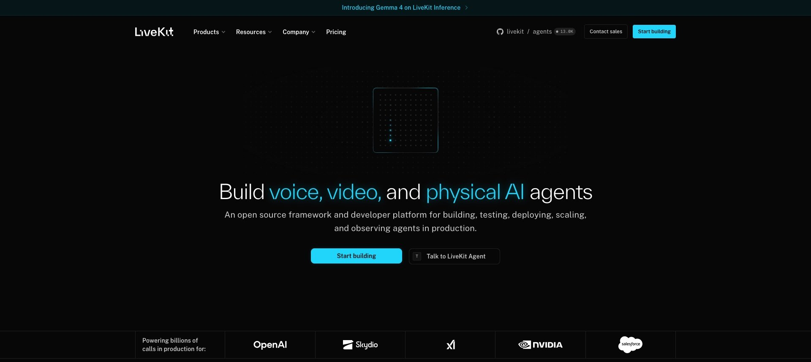

Adding a voice agent to a web application that already exists is mostly a plumbing problem. You need the microphone, a way to tell when the user started and stopped talking, a channel to your backend, an interruption path when the assistant is speaking over someone, and a place to put your business logic. [LiveKit Agents](https://livekit.io/agents) answers that by handing you a complete realtime media platform. When your product is a React front end talking to a Node backend, adopting that platform for one feature is a large step.

[Micdrop](/) answers the narrow version of the same problem. It is an MIT-licensed set of TypeScript packages that carry the browser side and the server side of a voice conversation, and nothing else.



## What LiveKit Agents does well

LiveKit is a WebRTC media server with an agent framework on top, and both halves are open source, the framework under Apache-2.0. The agents repository has more than 13,000 stars. The framework covers semantic turn detection through a transformer model, native MCP support, SIP telephony for inbound and outbound calls, video and vision, multi-agent handoff, and a managed deployment path with observability and recording.

That breadth is earned. LiveKit's own homepage lists OpenAI, NVIDIA and Salesforce among the companies running calls on it, and the plugin catalogue covers most of the speech and model providers a team would want. If your voice product involves phone numbers, video, or physical devices, this article ends here and LiveKit is your answer.

## Where LiveKit Agents gets heavy for a TypeScript team

### The Node SDK trails the Python one

`@livekit/agents` is real, maintained and shipping releases. Its README describes it as a Node.js distribution of the LiveKit Agents framework, originally written in Python, and the plugin table it publishes lists twenty-two packages, against a much longer list on the Python side. A TypeScript team therefore works on the smaller of the two SDKs, on a roadmap set elsewhere. That gap keeps closing, and it is still the gap you inherit today.

### An agent is a participant in a WebRTC room

The mental model is the same in both languages. A worker process authenticates against a LiveKit server, accepts a job, and joins a room as a participant that subscribes to audio tracks. Rooms and SFUs exist because many-to-many media is hard. A browser talking to your own backend is one-to-one, so most of that topology is machinery you operate without using it. Self-hosting means running the media server yourself. The alternative is LiveKit Cloud.

### A second process to deploy

`defineAgent`, `prewarm`, `entrypoint`, `WorkerOptions` and the `cli` helper describe a worker with its own lifecycle, sitting next to the Node server you already deploy. Two services, two sets of logs, two scaling stories, for one voice feature inside one product.

### Per-minute billing on top of provider billing

LiveKit Cloud starts free with 1,000 agent session minutes, five concurrent sessions and 5,000 WebRTC minutes. Past that, agent sessions bill at $0.01 per minute and WebRTC minutes at $0.0005, with paid plans opening at $50 and $500 per month (prices read on the LiveKit pricing page in August 2026). Those amounts land on top of what you already pay your speech and model providers. The pricing is reasonable for what the platform does, and it is a per-minute line that grows with usage.

## The Micdrop pipeline, TypeScript end to end

Micdrop keeps the browser and the server in one language, with a WebSocket between them. The browser package captures the microphone, runs voice activity detection locally, streams audio only while someone is speaking, plays the answer back and exposes the call state. The server package orchestrates the agent, the speech-to-text and the text-to-speech.

The browser side is two lines:

```typescript
import { Micdrop } from '@micdrop/client'

await Micdrop.start({ url: 'wss://your-app.com/call' })
```

The server side attaches to a socket you already have:

```typescript
import { MicdropServer } from '@micdrop/server'
import { OpenaiAgent } from '@micdrop/openai'
import { GladiaSTT } from '@micdrop/gladia'
import { ElevenLabsTTS } from '@micdrop/elevenlabs'
import { WebSocketServer } from 'ws'

const wss = new WebSocketServer({ port: 8081 })

wss.on('connection', (socket) => {
  new MicdropServer(socket, {
    firstMessage: 'How can I help you today?',
    agent: new OpenaiAgent({
      apiKey: process.env.OPENAI_API_KEY,
      systemPrompt: 'You are a helpful assistant',
      autoSemanticTurn: true,
      autoIgnoreUserNoise: true,
    }),
    stt: new GladiaSTT({ apiKey: process.env.GLADIA_API_KEY }),
    tts: new ElevenLabsTTS({
      apiKey: process.env.ELEVENLABS_API_KEY,
      voiceId: process.env.ELEVENLABS_VOICE_ID,
    }),
  })
})
```

Micdrop adds a socket handler to the [Fastify](/docs/server/with-fastify) or [NestJS](/docs/server/with-nestjs) application you already run, and the audio goes through the same load balancer as the rest of your traffic. The room, the worker and the media server have no equivalent here because there would be nothing for them to do.

Two behaviours that usually cost time are options rather than code. [Semantic turn detection](/docs/server/semantic-turn-detection) asks the model whether the user finished their thought before answering, which stops the assistant from cutting in on a mid-sentence pause. Noise filtering drops the "uh" and "hmm" that would otherwise trigger a full round trip. On the browser side, [voice activity detection](/docs/client/vad) runs on volume, on a Silero model, or on both at once, which is how you trade latency against false positives.

Keys stay yours. Micdrop calls the providers you configure with your own credentials, so the only per-minute bills are theirs. Provider choice is open through [the AI integrations](/docs/ai-integration), including a fully European stack with [Mistral, Gladia and Gradium](/docs/ai-integration/sovereign-voice-ai), and each layer accepts a fallback provider that takes over when the primary one fails.

## API equivalences for a migration

Most of a migration is deleting the transport layer.

| LiveKit Agents | Micdrop |
|---|---|
| Room and participants | One WebSocket per call |
| Worker, job, `entrypoint` | The upgrade handler of your existing server |
| `AgentSession` | `new MicdropServer(socket, options)` |
| `defineAgent` with `instructions` | `agent` option with `systemPrompt` |
| STT, LLM and TTS plugins | `stt`, `agent` and `tts` options |
| `llm.tool` with a Zod schema | `agent.addTool` with a Zod schema |
| Turn detector plugin | `autoSemanticTurn: true` |
| Server-side Silero VAD plugin | `vad: 'silero'` in the browser |
| LiveKit client SDK plus your own UI state | `@micdrop/client` and `@micdrop/react` hooks |
| `livekit-cli` deployment | Your existing Node deployment |

The prompt, the tools and the provider keys carry over almost unchanged. What disappears is the room lifecycle and the worker process.

## Feature comparison

This comparison was checked in August 2026, and both projects keep moving fast.

| Aspect | LiveKit Agents | Micdrop |
|---|---|---|
| **Languages** | Python and Node.js | TypeScript only |
| **Transport** | WebRTC through an SFU | WebSocket |
| **Browser package** | WebRTC client SDKs, UI state on you | Mic, speaker, VAD and call state |
| **Deployment** | Worker process, self-hosted or LiveKit Cloud | Inside your existing Node server |
| **Telephony (SIP/PSTN)** | Yes | No |
| **Video and vision** | Yes | No, voice only |
| **Turn detection** | Transformer model | LLM-based, one option |
| **Provider fallback** | On you | Built in for agent, STT and TTS |
| **Tool calling** | Yes, with Zod | Yes, with Zod |
| **React** | Components and hooks | `@micdrop/react` hooks |
| **Observability dashboard** | Yes, on LiveKit Cloud | No |
| **Pricing** | Free tier, then per minute | Your provider bills only |
| **License** | Apache-2.0 | MIT |
| **Community** | Above 13,000 stars | Small and young |

## What Micdrop leaves to LiveKit

Micdrop ships no infrastructure of its own. The media server, the phone numbers, the SLA and the hosted plan all sit outside the packages, and a single maintainer stands behind Micdrop rather than a company with a support desk. The project started in 2025, so its community is a fraction of LiveKit's and you will find fewer tutorials and fewer third-party plugins.

## How to choose

Pick LiveKit Agents when voice is your product rather than a feature of it, when you need SIP and a phone number, when video or vision is part of the experience, when your backend already runs Python, or when a managed platform with observability is worth its per-minute price.

Pick Micdrop when you are adding voice to a web application, when your stack is Node and TypeScript and you would rather keep it that way, when you want the browser side handled for you instead of assembling it on top of a WebRTC SDK, and when the only per-minute bills you want are the ones from the providers you picked.

The same reasoning applies to Pipecat, the other open source framework on this terrain, which we compared with Micdrop in [the Pipecat comparison](/blog/alternative-to-pipecat).

## Getting started

```bash
npm install @micdrop/server @micdrop/client @micdrop/openai @micdrop/gladia @micdrop/elevenlabs
```

The [Getting Started guide](/docs/getting-started) walks through a working call in a few minutes, and the [React hooks](/docs/client/react-hooks) cover the UI states you will want to render.

LiveKit built the media platform that a large slice of the voice industry runs on, and choosing it means taking that platform on, either running the media server or paying for its cloud plan. When your voice feature lives inside a web app you already ship, a WebSocket to your own Node server and a browser package that knows what a microphone is will get you there with less to operate.
