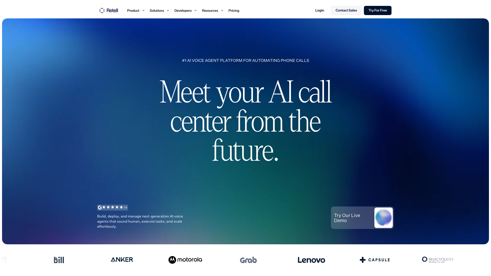

[Retell AI](https://www.retellai.com) sells an AI call center. Its own headline says so, and everything in the product follows from it: agents you configure in a dashboard, calls as the unit of analytics, per-minute billing, warm transfers, IVR navigation, batch dialing. Teams building a phone operation get a lot for the money. Teams adding a voice mode to a web application end up paying a call-center meter for something that never touches a phone line.

[Micdrop](/) is a library you install instead. `@micdrop/client` handles the browser and `@micdrop/server` handles Node, both MIT licensed and written in TypeScript, and together they run the speech-to-text, model and text-to-speech pipeline inside a server you already deploy. Your users talk to your application in a tab, the conversation runs in your process, and your bill comes from the speech and model providers you chose.

Start with what your product is. If it makes and answers phone calls, Retell is the better fit. If voice is a screen in a web app you already operate, the per-minute meter is buying you infrastructure you have.



## What Retell AI does well

Retell says its agents have handled more than 200 million calls, it publishes customer logos including Motorola, Lenovo, Anker and Grab, and it holds a 4.8 average over roughly 1,750 G2 ratings. It carries SOC 2 Type 1 and Type 2, signs a GDPR data processing addendum, and lets you self-sign a HIPAA business associate agreement online at no extra cost, which is unusually direct for that paperwork.

The product does much more than orchestrate a call. You build agents either as a single prompt or as a node-based conversation flow, attach a knowledge base fed by crawled pages and uploaded documents, and connect CRMs, helpdesks and calendars through prebuilt integrations. Before a release you run graded simulation test cases and A/B tests on live traffic. During a call you can watch it live and take over. Afterwards you get success scoring, sentiment analysis, full transcripts and an AI quality-assurance pass. For phone calls, Retell handles warm transfer, IVR navigation, DTMF capture, batch calling and branded caller ID.

A library does not attempt that. Decide which of those pieces your product needs, and you know whether a library covers you.

## Why teams look for a Retell AI alternative

### The meter runs on minutes, including the model

Retell's pay-as-you-go pricing lands between $0.07 and $0.31 a minute, assembled from separate lines. The voice infrastructure is $0.055 a minute. Platform voices add $0.015, premium voices up to $0.040. The model is charged per minute too, from $0.003 for a small model to around $0.16 for a frontier one. US telephony adds $0.015, and bringing your own SIP trunk costs nothing extra. Then come the per-minute add-ons: a knowledge base at $0.005, advanced denoising at $0.005, safety guardrails at $0.005, PII removal at $0.01, and AI quality assurance at $0.10 after the first hundred minutes.

The per-minute model charge is what surprises people. A conversation where the user thinks for eight seconds before answering burns the same model minute as one where they talk over the assistant. Token pricing follows what the model actually processed, and minute pricing follows the clock, so the two diverge exactly on the calls where a human is doing the slow part.

A mid-range web-app configuration, infrastructure plus a platform voice plus a mid-tier model, sits near $0.115 a minute before any add-on. At 30,000 minutes a month that is around $3,450, for a loop your own server could run.

### Concurrency is a monthly subscription line

Twenty concurrent calls come with the account, and each additional one is $8 a month. For an outbound campaign you set that number yourself, from the volume you plan to dial. For a voice feature inside a product, concurrency is whatever your users happen to do at the same time, and that traffic swings hard. A product demo or a Monday morning across two time zones leaves you provisioning headroom you pay for all month, or watching calls queue at the ceiling.

On a server you run, the same spike is CPU and sockets on infrastructure you already scale for the rest of the application.

### Your agent logic sits behind a WebSocket Retell dials into

The moment your agent needs to do something the dashboard does not express, Retell's answer is a custom LLM. You stand up a public `wss://` endpoint, register it as the agent's `llm_websocket_url`, and Retell connects to it during the call. It sends you events tagged with an `interaction_type`, `response_required` when it wants the next turn, `update_only` for live transcript updates, `reminder_required` when the user has gone quiet, `ping_pong` to keep the socket alive, and you stream back the response content.

It works, and it turns the usual arrangement around. That endpoint has to be reachable from the public internet, the connection arrives from Retell rather than from your user's browser, and the conversation state lives on the platform between turns. So the socket handler sits outside your normal middleware, and re-establishing who is calling means passing metadata through the platform and trusting it on the way back.

For a phone agent that trade is reasonable, since there was no browser session to begin with. For a logged-in user in a tab, you are routing your own user's conversation out to a third party and back, outside the session you control.

### The conversation runs outside the EU

Retell runs on AWS, and its compliance documentation states that its services operate outside the European Union, with no zero-retention tier. Retention is configurable per agent from one day up to two years.

Most teams never think about it. For a European product handling recorded voice, or anyone whose data map has to name every processor, adding a US orchestration layer between the browser and the model providers is one more processor to justify. Running the loop on your own servers leaves only the providers you chose.

### You replay a bad turn instead of stepping through it

When a call goes wrong, the turn that broke it ran on Retell's machines. You get the transcript, the recording, the node transitions, the sentiment score and the timings, which is a lot, and you get them after the fact. Reproducing the bad turn means placing another call and hoping it misbehaves the same way, because there is no local process to attach a debugger to and no way to step through the decision that cut the user off mid-sentence.

Turn-taking, interruption handling and end-of-turn detection are platform behaviour too, adjusted through agent settings, and the code behind those decisions stays out of reach.

## How Micdrop runs the loop inside your own server

### The voice loop starts inside your authenticated session

A Micdrop call is a WebSocket from the browser to your own Node server. The client sends parameters when it connects, and [`waitForParams`](/docs/server/auth-and-parameters) validates them with a Zod schema before the conversation starts, so a JWT check or a session lookup happens where every other one in your app happens.

From that point the agent runs next to your data. A [tool call](/docs/server/tools) is a function with a Zod schema executing in the same process, so it queries your database directly rather than travelling back over HTTP with an identity to re-establish. The system prompt can carry the user's plan, their last order or their onboarding state, because you built it from the session you already loaded. Listen to one event to store what was said, and the [message persistence guide](/docs/server/save-messages) shows how to write straight into your own tables.

### You pay providers by the token, and nothing per minute

Micdrop is MIT licensed and published on npm, with no account to create and no service to subscribe to. You bring your own provider keys, the audio goes from your server straight to those providers, and your contract for speech, the model and the voice is with each of them directly.

That changes how the bill is built as much as how big it is. The model bills tokens, the voice bills characters, transcription bills audio duration, and each one meters what it actually did. Silence costs you nothing at the model. Nobody can reprice the orchestration layer under you, because the orchestration is a package in your `node_modules`. At ten times the traffic you pay ten times the provider usage and nothing else.

### One TypeScript codebase from the microphone to the model

`@micdrop/client` runs in the browser and handles the microphone, the speaker, voice activity detection and the connection. `@micdrop/server` runs in your Node process and orchestrates the agent, the speech-to-text and the text-to-speech. Both are TypeScript, and they share types across the wire. `@micdrop/react` adds hooks for the states your UI needs to render.

```typescript
import { MicdropServer } from '@micdrop/server'
import { OpenaiAgent } from '@micdrop/openai'
import { GladiaSTT } from '@micdrop/gladia'
import { ElevenLabsTTS } from '@micdrop/elevenlabs'
import { WebSocketServer } from 'ws'

const wss = new WebSocketServer({ port: 8081 })

wss.on('connection', (socket) => {
  new MicdropServer(socket, {
    firstMessage: 'How can I help you today?',
    agent: new OpenaiAgent({
      apiKey: process.env.OPENAI_API_KEY,
      systemPrompt: 'You are a helpful assistant',
    }),
    stt: new GladiaSTT({ apiKey: process.env.GLADIA_API_KEY }),
    tts: new ElevenLabsTTS({
      apiKey: process.env.ELEVENLABS_API_KEY,
      voiceId: process.env.ELEVENLABS_VOICE_ID,
    }),
  })
})
```

That WebSocket server sits in the same application as your authentication, your ORM and your feature flags. One language means one toolchain: the same linter, test runner, CI and deploy cover the voice pipeline and the rest of the app, and the type the server sends is the type the browser expects, checked at build time rather than during a call. Most voice AI libraries are written in Python, so a TypeScript team absorbs one as a second service to run, and that is the [whole comparison against Pipecat](/blog/alternative-to-pipecat).

### Any provider you want, including a fully European stack

[Provider integrations](/docs/ai-integration) ship for OpenAI, Mistral, ElevenLabs, Cartesia, Gladia, Gradium and the Vercel AI SDK, and moving from one to another is changing a constructor. Running Mistral for the model, Gladia for the transcription and Gradium for the voice keeps the conversation inside the EU, with no change to the orchestration code, and the [sovereign stack guide](/docs/ai-integration/sovereign-voice-ai) walks through it. Micdrop makes a European architecture possible, and the compliance of your deployment stays yours and your providers'.

`@micdrop/server` handles outages too. `FallbackTTS` takes a list of factories and walks down it when a provider stops answering:

```typescript
import { FallbackTTS } from '@micdrop/server'
import { ElevenLabsTTS } from '@micdrop/elevenlabs'
import { CartesiaTTS } from '@micdrop/cartesia'

const tts = new FallbackTTS({
  factories: [
    () =>
      new ElevenLabsTTS({
        apiKey: process.env.ELEVENLABS_API_KEY,
        voiceId: process.env.ELEVENLABS_VOICE_ID,
        maxRetry: 2,
      }),
    () =>
      new CartesiaTTS({
        apiKey: process.env.CARTESIA_API_KEY,
        modelId: 'sonic-turbo',
        voiceId: process.env.CARTESIA_VOICE_ID,
        maxRetry: 3,
      }),
  ],
})
```

The pending text is buffered and replayed on the second provider, so the user hears a short pause instead of a dropped call. The same pattern covers [speech-to-text](/docs/ai-integration/fallback-strategies/stt-fallback) and the agent itself. A provider Micdrop lacks is one you add yourself. `Agent`, `STT` and `TTS` are abstract classes on an event emitter: implement the interface, or subclass a provided one to override the method you disagree with and keep the others.

### The real-time plumbing is already written

Micdrop comes with the details that separate a voice demo from a feature you can ship. [Voice activity detection](/docs/client/vad) runs in the browser, so audio travels only while someone is speaking, which is what makes a WebSocket enough for a one-to-one call. It accepts `'volume'`, `'silero'`, your own implementation, or several combined when you want to tune latency against false positives. [Semantic turn detection](/docs/server/semantic-turn-detection) asks the model whether the sentence is finished instead of counting milliseconds of silence, so the assistant stops interrupting people mid-thought. [Noise filtering](/docs/server/noise-filtering) drops the "uh" and the throat clearing before they trigger a model call. [Conversation resume](/docs/server/resume-conversation) rehydrates the agent after a dropped socket, and `MicdropRecorder` hands you raw PCM buffers tied to each message when you want to keep the audio.

In the UI, [React hooks](/docs/client/react-hooks) expose the client state, conversation and errors included, through `useMicdropState`, plus live microphone and speaker levels through `useMicVolume` and `useSpeakerVolume`, so a waveform reacting to the user's voice is a few lines. Tool calls reach the client too, arriving as entries in the conversation history, so showing what the assistant is doing or asking the user to confirm it is a rendering job.

Products already run on Micdrop. [Raconte.ai](https://raconte.ai) conducts voice interviews and is built by Micdrop's maintainer. [Cibli](https://cibli.fr), a recruitment platform where candidates answer out loud, is built by a separate team. Both ship the browser and server packages together.

## Head to head

Retell published these prices in August 2026. Voice AI pricing moves fast, so check Retell's pricing page before you commit a budget.

| | Retell AI | Micdrop |
|---|---|---|
| **Where the conversation runs** | Retell's infrastructure on AWS | Your Node process |
| **How you get it** | Hosted platform, closed orchestration engine | MIT library on npm |
| **Server language** | Any, through the REST API and a WebSocket | TypeScript / Node.js |
| **Agent authoring** | Dashboard, single prompt or node-based flow | Code, in your repository |
| **Custom logic** | A public WebSocket Retell connects to | Functions and Zod schemas in your process |
| **How the model is billed** | Per minute of call, by tier | Per token, by your provider |
| **Platform fee** | $0.055 / min of voice infrastructure | None |
| **Concurrency** | 20 included, then $8 / line / month | Your server capacity |
| **Browser SDK** | `retell-client-js-sdk`, transcript and raw audio events | `@micdrop/client`, plus React hooks |
| **Turn-taking and interruptions** | Platform behaviour, tuned in agent settings | Code you read, configure and replace |
| **Phone numbers, SIP / PSTN** | Yes, with warm transfer, IVR and DTMF | Not covered |
| **Testing and monitoring** | Simulation tests, A/B tests, live monitoring, AI QA | Your test suite, plus `MockAgent` |
| **Dashboard, transcripts, analytics** | Included, with sentiment and success scoring | Events and hooks, you build the UI |
| **Compliance** | SOC 2 Type 1 and 2, GDPR DPA, self-serve HIPAA BAA | Determined by your hosting and providers |
| **EU hosting** | Outside the EU, per Retell's compliance docs | Wherever you deploy |
| **Data retention** | 1 day to 2 years per agent | Whatever your database does |
| **Community** | Large, active, with 24/7 support on Enterprise | Small, young, one maintainer |

The community gap deserves as much weight as the price gap. Retell has a support organisation and a user base that has already hit your bug, and Micdrop has neither.

## What each option costs

Retell starts at $0 with $10 of free credits and 20 concurrent calls included. On top of the per-minute lines, phone numbers are $2 a month, verified ones $10, SMS $20, extra concurrency $8 a line, and knowledge bases $8 each past the first ten. Enterprise is a custom contract with uncapped concurrency, a dedicated server, SSO and 24/7 support.

Micdrop costs nothing to install. You pay speech-to-text, the model and text-to-speech at list price, directly to each provider, plus whatever your server already costs to run. A free tier and an enterprise tier both need a company behind them, and Micdrop is a package.

Which one is cheaper depends on volume and on what you count. At low volume the difference is noise, and Retell's free credits cost less than the engineering time a self-hosted pipeline would take. At high volume with phone numbers, compliance deadlines and a support contract, the alternative to Retell's Enterprise plan is hiring people to do that work, and the platform is usually the better fit.

## Who should choose which

**Choose Retell AI** when your product is phone calls. Inbound and outbound routing, SIP integration into a contact centre, warm transfer, IVR navigation, DTMF and batch dialing are the whole platform, and rebuilding them is a company's worth of work. Choose it when you need SOC 2 or a signed BAA this quarter rather than in two, when someone outside the engineering team has to change a prompt or a flow, when simulation tests and live call monitoring are how your team ships changes, or when the people operating the voice feature work outside your Node stack.

**Choose Micdrop** when voice is a feature of a web application you already deploy. The signals are clearest when your backend is TypeScript, when the agent needs your database and your session context on every turn, when per-minute fees scale badly against your unit economics, when concurrency is driven by your users rather than by a campaign, when your data map cannot easily absorb a US hop, or when you want to read the code that decides when the user stopped talking.

If you have not built the feature yet, build the first version on Retell. You learn more about your prompt, your voice choice and how people talk to your product from Retell's free credits and playground than from any architecture decision. The choice between the two only starts to matter once enough people use the feature for the meter to show up in your budget. If you already suspect you will move at that point, keep your prompt and your tool logic in your own repository rather than in Retell's dashboard, and the move costs you an afternoon instead of a rewrite.

Plenty of teams should use neither. If you have committed to one model vendor and only need a voice loop, [a realtime API from that vendor](/blog/openai-realtime-api-vs-pipeline) has fewer moving parts than Retell or Micdrop. If your backend is Python and you need telephony, Pipecat and LiveKit Agents are the serious answers, and the whole field is ranked in [open source voice agent frameworks](/blog/open-source-voice-agent-frameworks).

## What adopting Micdrop involves

### Starting fresh

The [Getting Started guide](/docs/getting-started) gets a browser talking to a Node server in about five minutes: install the two packages, give `MicdropServer` an agent, a speech-to-text provider and a voice, and open a WebSocket. The only accounts you create are at the providers.

Wiring that into a real application, with your authentication, your session and your own UI around it, is an afternoon's work rather than a sprint. Transcript storage, call history for your support team, sentiment or success scoring and alerting when a provider degrades take longer, and they are yours to write, on top of a database and a logger you probably already run.

### Coming from Retell AI

There is no import tool, so you rebuild the agent by hand. That is less work than it sounds, because most of what you built is prompt text and business logic that carries straight across.

A single-prompt agent moves over almost unchanged, into the `systemPrompt` of the agent class. A conversation flow takes more thought, since Micdrop has no node graph: the branches become code, either as instructions in the prompt or as conditions around the tools you expose, and the flow shrinks once it lives in a language with `if`. Micdrop integrates with many of the same speech and model vendors, so a stack on OpenAI, ElevenLabs, Cartesia or Gladia transfers as is and the same voice ID keeps working.

Each Retell function becomes a function registered on the agent with a Zod schema, and the body usually gets shorter, because it now runs where your database connection already lives. If you built a custom LLM WebSocket server, that logic collapses into the agent itself and the public endpoint disappears, along with the metadata you were threading through the platform to know who was calling.

In the browser, `@micdrop/client` replaces `retell-client-js-sdk`, and `Micdrop.start({ url })` replaces the access-token exchange, pointing at your own server rather than at an agent on the platform. Both SDKs report the same events: call start and end, speech boundaries, transcript updates. The UI you already built maps across with renamed handlers.

Anything answering a phone number stays where it is. Micdrop covers the web leg, so a product doing both keeps Retell for the calls and moves the in-app conversation. Run the two in parallel behind a feature flag, and keep the Retell agent live until the traffic has moved.

## Frequently asked questions

<FaqList>
  <FaqItem question="What are some good alternatives to Retell AI?">
    It depends on which half of Retell you need. Among hosted platforms, Vapi, Bland and Synthflow cover the same ground, with Vapi the most developer-oriented and Synthflow the one that publishes EU hosting. Among self-hosted options, Pipecat and LiveKit Agents are the two largest frameworks, both Python-first with telephony support, Dograh is the platform-shaped one, and Micdrop handles a voice conversation inside a TypeScript web application. Platforms sell you an operated service, frameworks give you code to run yourself, and the two are priced on different axes.
  </FaqItem>
  <FaqItem question="Is there an open source alternative to Retell AI?">
    Yes, several exist. Dograh is the closest match to the product itself: BSD 2-Clause, self-hostable with Docker, with a visual workflow builder, bring-your-own-key support and telephony, so it replaces the platform rather than only its engine. Pipecat (BSD 2-Clause, Python), LiveKit Agents (Apache 2.0, Python and Node), Vocode, Bolna and the TEN Framework are code-first frameworks that replace the orchestration and leave the dashboard and the deployment to you. Micdrop (MIT, TypeScript) covers the narrower case of a browser talking to your own Node server. Whichever you pick, you now operate what Retell was operating for you.
  </FaqItem>
  <FaqItem question="Is there a free alternative to Retell AI?">
    Yes, every self-hosted framework is free to install: Pipecat, LiveKit Agents, Dograh, Vocode and Micdrop all carry permissive licences and no per-minute platform fee. Free applies to the software rather than to the calls. You still pay speech-to-text, the model and text-to-speech at each provider's list price, and you pay for the server that runs the pipeline. The saving against a hosted platform is the orchestration fee, the concurrency subscription and the vendor margin, which is real money at 30,000 minutes a month and irrelevant at ten minutes a day.
  </FaqItem>
  <FaqItem question="How expensive is Retell AI?">
    Retell's pay-as-you-go pricing runs from $0.07 to $0.31 a minute in August 2026, assembled from separate lines: $0.055 a minute of voice infrastructure, $0.015 to $0.040 for the voice, the model billed per minute by tier from $0.003 to about $0.16, and $0.015 a minute for US telephony. Add-ons stack on top, from $0.005 a minute for a knowledge base or denoising up to $0.10 a minute for AI quality assurance. Twenty concurrent calls are included and each extra line is $8 a month, phone numbers are $2 a month, and Enterprise is a custom contract. The account starts at $0 with $10 of free credits.
  </FaqItem>
  <FaqItem question="What is the difference between ElevenLabs and Retell AI?">
    They sit at different layers. ElevenLabs is primarily a voice provider, selling text-to-speech and speech-to-text that any pipeline can call, and it also ships an agents product on top. Retell is an orchestration platform: it runs the whole conversation, connects to telephony, and buys voices from providers like ElevenLabs on your behalf, which is why its premium voice tiers cost more per minute. Micdrop sits at the orchestration layer too, as code you run rather than a service you rent, and it calls ElevenLabs directly with your own key.
  </FaqItem>
  <FaqItem question="Should I start a new project on Retell AI or on a self-hosted framework?">
    Pick by which unknown is bigger. If you are still unsure the voice feature will hold up with real users, Retell's playground answers that in a weekend, before you commit to any architecture. If the feature is a screen inside a web application and your backend already runs Node, starting on a library saves you a migration you can already see coming. Either way you can change your mind later. Rebuilding the pipeline takes hours, and what you throw away is the dashboard or the logging you built on top of it.
  </FaqItem>
  <FaqItem question="Does Micdrop support phone calls?">
    No. Micdrop connects a browser to your Node server over a WebSocket, and it has no SIP, PSTN or telephony layer. If your agent has to answer a phone number, a hosted platform like Retell or Vapi, or a telephony-capable framework like Pipecat or LiveKit Agents, is the right tool. Micdrop covers the web leg: a user talking to your application in a tab.
  </FaqItem>
  <FaqItem question="Is Retell AI a good product?">
    It scores well on the usual measures, with a G2 rating and SOC 2 coverage that are strong for the category, and Motorola, Lenovo and Grab put their names on it. The recurring criticisms in the G2 reviews are the learning curve, the number of voices available for languages other than English, and pricing that is hard to forecast because it is assembled from many per-minute components. It stays a good choice for a phone operation.
  </FaqItem>
</FaqList>

---

Retell and Micdrop are good at different jobs. Retell runs the conversation for you, answers phone numbers, carries SOC 2 and a signed BAA, and hands you a dashboard, a flow builder and call analytics on day one. If your product is phone calls, or you need those certifications this quarter, pay the per-minute rate and ship.

[Micdrop](/) fits the other case, a voice mode inside a product you already run. The conversation runs in your own Node server, next to the session and the database it needs, and you pay your providers directly with nothing metered on top. The first working call takes about five minutes with the [Getting Started guide](/docs/getting-started).
