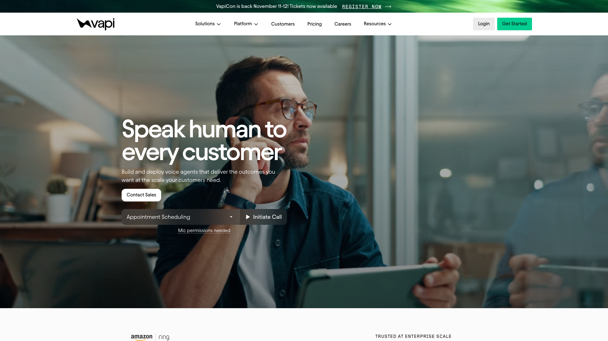

[Vapi](https://vapi.ai) is a hosted platform for building voice AI agents. You configure an assistant, pick a speech-to-text provider, a model and a voice, and Vapi runs the conversation on its own infrastructure, charging $0.05 a minute on top of what those providers bill you. In exchange you get phone numbers, a dashboard, compliance certifications and an SLA. For plenty of products that trade is obviously worth it.

[Micdrop](/) is a library you install instead. `@micdrop/client` handles the browser and `@micdrop/server` handles Node, both MIT licensed and written in TypeScript, and together they run the same speech-to-text, model and text-to-speech loop inside a server you already deploy. No platform sits in the middle, so there is no per-minute fee, and equally no dashboard, no phone numbers and nobody to call at 3am.

Whether the conversation runs on Vapi's servers or in yours drives everything else in this comparison: what you can debug, what you pay per minute, where the audio is stored, and whether you get a dashboard or build one. Neither answer suits every product, so the sections below say plainly which one fits which need.



## What Vapi does well

Vapi is the most developer-friendly of the hosted voice platforms, and it earned that position. The API is clean, the model configuration reads the way you expect, and the platform genuinely supports bringing your own provider keys rather than forcing every token through its billing, from a catalogue of speech and model vendors wider than anything a single library ships. It raised a $50M Series B in May 2026, has handled over a billion calls, and publishes real customer logos including Amazon Ring. It carries SOC 2, GDPR and PCI DSS, publishes a 99.9% SLA on its Scale tier and runs a public status page. Fallback is a first-class feature: you can configure backup voices, backup transcribers and backup models, and a non-fatal error swaps providers instead of dropping the call. None of that is small, and a library cannot hand you any of it.

## Why teams look for a Vapi alternative

### You pay $0.05 a minute even with your own API keys

The Build tier charges $0.05 a minute for the orchestration layer, and that number holds whether your model tokens are billed through Vapi or through your own OpenAI account. Bringing your own key removes the vendor margin on the model, and it leaves the platform fee exactly where it was. Above it sit ten included concurrent lines and then $10 per line per month, $0.005 per chat message, HIPAA at $2,000 a month and Zero Data Retention at $1,000 a month. Speech, model and telephony each bill separately again.

The total is rarely what stings. What stings is that it arrives on five or six separate meters, and the one you can predict least well is the platform fee, which grows every time someone uses the feature.

### Your business logic runs as a webhook Vapi calls

The moment your agent needs to do something the dashboard does not express, Vapi's answer is a custom LLM server. You expose a public endpoint shaped like `/chat/completions`, Vapi posts the conversation context to it, and you return a response formatted the way Vapi expects. It works, and it turns the usual arrangement around. Your business logic becomes a webhook that Vapi calls, it has to be reachable from the public internet, and the conversation history lives on Vapi's servers rather than in your process.

For a phone agent that is a reasonable trade. For a voice feature inside a web application it costs you the things you normally get for free: the request arrives from Vapi rather than from the browser, so you re-authenticate the user, reload the session and re-check permissions on every turn, from an endpoint that sits outside your usual middleware.

### Endpointing and barge-in stay on Vapi's side

`@vapi-ai/web` starts a call and streams audio over WebRTC through Daily, whose library it carries as a dependency. That transport is solid and it is also opinionated: it takes over audio handling for the page, and it can conflict with another Daily instance already running there. What you get is control over when the call starts, event listeners for transcripts and speech boundaries, and the ability to render your own UI on top. The turn-taking logic itself lives on the platform, and you tune it through assistant configuration rather than by editing code.

### Your audio passes through Vapi's servers

The audio has to reach the machines running the loop, so every call transits Vapi's infrastructure. Call data is retained 14 days on the Build tier, and turning retention off is a $1,000 monthly add-on. Most teams never think about it. For an EU team handling recorded voice, or anyone whose data map has to name every processor, adding a US orchestration layer between the browser and the model providers is a conversation with legal that running the loop on your own servers avoids entirely.

### You cannot debug the conversation locally

When a call goes wrong, the turn that produced it ran on Vapi's machines. You get the transcript, the call log and the timings, which is a lot, and you get them after the fact. Reproducing the bad turn means placing another call and hoping it misbehaves the same way, because there is no local process to attach a debugger to and no way to step through the decision that cut the user off mid-sentence.

Latency has the same problem. Vapi reports around 790ms end to end, and on the day a call hangs for two seconds you want to know whether the transcriber, the model or the voice spent them. From outside the pipeline you are reading timings someone else measured.

## How Micdrop approaches it differently

### One language from the microphone to the model

`@micdrop/client` runs in the browser and handles the microphone, the speaker, voice activity detection and the connection. `@micdrop/server` runs in your Node process and orchestrates the agent, the speech-to-text and the text-to-speech. Both are TypeScript, and they share types across the wire. `@micdrop/react` adds hooks for the states your UI needs to render.

One language means one toolchain. The same linter, test runner, CI and deploy cover the voice pipeline and the rest of the app, and the shape the server sends is the shape the browser expects, checked at build time rather than in a call. Most voice AI tooling is written in Python, which a TypeScript team normally absorbs as a second service to run, and we made that the [whole comparison against Pipecat](/blog/alternative-to-pipecat).

```typescript
import { MicdropServer } from '@micdrop/server'
import { OpenaiAgent } from '@micdrop/openai'
import { GladiaSTT } from '@micdrop/gladia'
import { ElevenLabsTTS } from '@micdrop/elevenlabs'
import { WebSocketServer } from 'ws'

const wss = new WebSocketServer({ port: 8081 })

wss.on('connection', (socket) => {
  new MicdropServer(socket, {
    firstMessage: 'How can I help you today?',
    agent: new OpenaiAgent({
      apiKey: process.env.OPENAI_API_KEY,
      systemPrompt: 'You are a helpful assistant',
    }),
    stt: new GladiaSTT({ apiKey: process.env.GLADIA_API_KEY }),
    tts: new ElevenLabsTTS({
      apiKey: process.env.ELEVENLABS_API_KEY,
      voiceId: process.env.ELEVENLABS_VOICE_ID,
    }),
  })
})
```

That WebSocket server sits in the same application as your authentication, your ORM and your feature flags. A [tool call](/docs/server/tools) is a function with a Zod schema that runs in that process, so it queries your database directly rather than posting to it.

### Your only bill comes from your providers

Micdrop is MIT licensed and published on npm, with no account to create and no service to subscribe to. You bring your own provider keys, the audio goes from your server straight to those providers, and your contract for speech, the model and the voice is with each of those vendors directly.

So a voice feature costs you what those three providers charge, plus the server you were already running. There is no second line that grows alongside them, and nobody can reprice the orchestration layer under you, because the orchestration is a package in your `node_modules`. At ten times the traffic you pay ten times the provider usage and nothing else.

### Any provider, with a backup when it fails

[Provider integrations](/docs/ai-integration) ship for OpenAI, Mistral, ElevenLabs, Cartesia, Gladia, Gradium and the Vercel AI SDK, and moving from one to another is changing a constructor.

Outages are handled in the same place. `FallbackTTS` takes a list of factories and walks down it when a provider stops answering:

```typescript
import { FallbackTTS } from '@micdrop/server'
import { ElevenLabsTTS } from '@micdrop/elevenlabs'
import { CartesiaTTS } from '@micdrop/cartesia'

const tts = new FallbackTTS({
  factories: [
    () =>
      new ElevenLabsTTS({
        apiKey: process.env.ELEVENLABS_API_KEY,
        voiceId: process.env.ELEVENLABS_VOICE_ID,
        maxRetry: 2,
      }),
    () =>
      new CartesiaTTS({
        apiKey: process.env.CARTESIA_API_KEY,
        modelId: 'sonic-turbo',
        voiceId: process.env.CARTESIA_VOICE_ID,
        maxRetry: 3,
      }),
  ],
})
```

The pending text is buffered and replayed on the second provider, so the user hears a short pause instead of a dropped call. The same pattern covers [speech-to-text](/docs/ai-integration/fallback-strategies/stt-fallback) and the agent itself.

### Every part of it is yours to change

Micdrop is open at three levels: the interface, the pipeline, and the classes underneath.

The interface comes first, since Micdrop ships no widget and nothing to restyle. [React hooks](/docs/client/react-hooks) expose the whole state locally, conversation and errors through `useMicdropState`, plus live microphone and speaker levels through `useMicVolume` and `useSpeakerVolume`, so a waveform reacting to the user's voice is a few lines rather than a feature request. Voice activity detection is open in the same way, taking `'volume'`, `'silero'`, your own implementation passed as an instance, or several combined in an array when you want to tune latency against false positives. Tool calls reach the client too, arriving as entries in the conversation history, so showing what the assistant is doing or asking the user to confirm it is a rendering job rather than an integration.

Underneath, `Agent`, `STT` and `TTS` are abstract classes on an event emitter. Bring your own provider by implementing the interface, or subclass a provided one to override the method you disagree with and keep the rest. `MicdropServer` emits the raw user and assistant audio as it flows, the agent emits every message, tool call and end-of-call decision, and `MockAgent` runs the whole pipeline in your test suite without spending anything at a provider. When none of that goes far enough, the licence is MIT and the code is yours to fork.

### A fully European stack is a configuration change

Swapping OpenAI for Mistral, Gladia for the transcription and Gradium for the voice keeps every packet of a conversation inside the EU, with no change to the orchestration code. The [sovereign stack guide](/docs/ai-integration/sovereign-voice-ai) walks through it. The claim stays narrow on purpose. Micdrop makes a sovereign architecture possible, and the compliance of your deployment stays yours and your providers'.

### The real-time plumbing is already written

Micdrop comes with the details that separate a voice demo from a feature you can ship. [Voice activity detection](/docs/client/vad) runs in the browser, so audio travels only while someone is speaking, which is what makes a WebSocket enough for a one-to-one call. [Semantic turn detection](/docs/server/semantic-turn-detection) asks the model whether the sentence is finished instead of counting milliseconds of silence, so the assistant stops interrupting people mid-thought. Noise filtering drops the "uh" and the throat clearing before they trigger a model call. [Conversation resume](/docs/server/resume-conversation) rehydrates the agent after a dropped socket, and `MicdropRecorder` hands you raw PCM buffers tied to each message when you want to keep the audio.

Products already run on this. [Raconte.ai](https://raconte.ai) conducts voice interviews and is built by Micdrop's maintainer, which is worth saying out loud when it is cited as proof. [Cibli](https://cibli.fr), a recruitment platform where candidates answer out loud, is built by a separate team. Both ship the browser and server packages together.

## Head to head

The figures below are the ones published in August 2026. Voice AI pricing moves fast, so check Vapi's pricing page before you commit a budget.

| | Vapi | Micdrop |
|---|---|---|
| **Where the conversation runs** | Vapi's infrastructure | Your Node process |
| **How you get it** | Hosted platform, closed orchestration engine | MIT library on npm |
| **Server language** | Any, through HTTP webhooks | TypeScript / Node.js |
| **Browser transport** | WebRTC through Daily | WebSocket, with VAD in the browser |
| **Custom logic** | An OpenAI-shaped endpoint Vapi calls back | Functions and Zod schemas in your process |
| **Extending the built-ins** | Assistant configuration, then a webhook | Swap the VAD, subclass any class, fork the code |
| **Platform fee** | $0.05 / min on Build, custom on Scale | None |
| **Provider fallback** | Voice, transcriber and model fallback plans | `FallbackTTS`, `FallbackSTT`, agent fallback |
| **Phone numbers, SIP / PSTN** | Yes, US and Canada mainly | Not covered |
| **Dashboard, transcripts, logs** | Included | Events and hooks, you build the UI |
| **Compliance** | SOC 2, GDPR, PCI DSS, HIPAA at $2,000 / mo | Determined by your hosting and providers |
| **SLA and status page** | 99.9% on Scale | You operate it |
| **Data retention** | 14 days on Build, no-retention at $1,000 / mo | Whatever your database does |
| **Community** | Large, funded, active Discord | Small, young, one maintainer |

That last row deserves the same weight as the price row. Vapi has a Discord full of people who have hit your bug already, and Micdrop does not.

## What it actually costs

Vapi's Build tier is usage-based: $0.05 a minute of platform fee, 60+ free minutes to start, ten concurrent lines included and $10 per additional line per month, chat at $0.005 a message, and speech and model costs passed through at provider rates or billed to your own keys. Scale is an annual contract with volume-based per-minute pricing and a dedicated account team. HIPAA and Zero Data Retention are add-ons at $2,000 and $1,000 a month.

Micdrop costs nothing to install. You pay speech-to-text, the model and text-to-speech at list price, directly to each provider, plus whatever your server already costs to run. There is no free tier because there is no service, and there is no enterprise tier because there is nobody to call.

Which one is cheaper depends on volume and on what you count. At low volume the platform fee is noise, and Vapi's free minutes make it cheaper than your engineering time. At 30,000 minutes a month, a modest in-app voice feature, the platform fee alone reaches $1,500 before a single second of speech, which is a lot to pay for orchestration your own server could run. At high volume with phone numbers, compliance requirements and a support contract, the alternative to Vapi's Scale tier is hiring people to do that work, and the platform is usually the better fit.

## Who should choose which

**Choose Vapi** when your product is phone calls. Inbound and outbound routing, SIP integration into a contact centre, call transfer, voicemail detection and a carrier relationship are the whole platform, and rebuilding them is a company's worth of work. Choose it when you need SOC 2 or PCI DSS today rather than in two quarters, when an SLA has to appear in a customer contract, when non-engineers need a dashboard to change a prompt, or when the team that will operate this does not run Node in production.

**Choose Micdrop** when voice is a feature of a web application you already deploy. The clearest signals: your backend is TypeScript, the agent needs your database and your session context on every turn, per-minute fees scale badly against your unit economics, your data map cannot easily absorb a US orchestration hop, or you want to read the code that decides when the user stopped talking.

If you have not built the feature yet, build the first version on Vapi. A weekend on its free minutes tells you more about your prompt, your voice choice and how people actually talk to your product than any architecture decision will. The choice between the two only starts to matter once enough people use the feature for the per-minute fee to show up in your budget. If you already suspect you will move at that point, keep your prompt and your tool logic in your own repository rather than in Vapi's dashboard, and the move costs you an afternoon instead of a rewrite.

Plenty of teams should use neither. If you have committed to one model vendor and only need a voice loop, a realtime API from that vendor is fewer moving parts than either option here. If your backend is Python and you need telephony, Pipecat and LiveKit Agents are the serious answers, and we ranked the whole field in [open source voice agent frameworks](/blog/open-source-voice-agent-frameworks).

## What adopting Micdrop involves

### Starting fresh

The [Getting Started guide](/docs/getting-started) gets a browser talking to a Node server in about five minutes: install the two packages, give `MicdropServer` an agent, a speech-to-text provider and a voice, and open a WebSocket. Provider keys are the only accounts you create, and there is nothing to sign up for on the Micdrop side.

Wiring that into a real application, with your authentication, your session and your own UI around it, is an afternoon's work rather than a sprint. What takes longer is the part a platform would have handed you: storing transcripts, showing call history to your team and alerting when a provider degrades are all yours to write, on top of a database and a logger you probably already run. [Message persistence](/docs/server/save-messages) and the recording hooks surface the events, and the interface on top of them is yours.

### Coming from Vapi

There is no import tool, so you rebuild the assistant by hand. That is less work than it sounds, because most of what you built is prompt text and business logic that carries straight across.

Your system prompt moves over unchanged, into the `systemPrompt` of the agent. Your provider choices transfer as configuration, since both products call the same speech and model vendors, so the same voice ID keeps working. Your tools are the real work: each Vapi function becomes a function registered on the agent with a Zod schema, and the body usually gets shorter, because it now runs where your database connection already lives instead of behind an HTTP round trip. If you built a custom LLM server, that logic collapses into the agent itself and the endpoint disappears.

On the browser side, `@micdrop/client` replaces `@vapi-ai/web`, and `Micdrop.start({ url })` replaces `vapi.start(assistantId)`, pointing at your own server rather than at an assistant on the platform. Both SDKs surface the same conversational moments (call start and end, speech boundaries, transcript messages), so the UI you already built maps across with renamed handlers rather than a rewrite.

The pipeline itself goes back up in hours. What takes longer is rebuilding the dashboard and the call history, which stop being included the day you leave. Run both stacks in parallel behind a feature flag, and keep the Vapi assistant answering until the traffic has moved.

## Frequently asked questions

<FaqList>
  <FaqItem question="Who are the main competitors of Vapi?">
    Vapi competes on two fronts. Among hosted platforms, Retell AI, Bland and Synthflow cover similar ground, with Retell strongest on contact-centre integrations and Synthflow the only one publishing EU hosting. Among self-hosted frameworks, Pipecat and LiveKit Agents are the two largest, both Python-first, and Micdrop covers the narrower case of a voice conversation inside a TypeScript web application. The two groups compete on different things: platforms sell you an operated service, frameworks give you code to run yourself.
  </FaqItem>
  <FaqItem question="What are some free alternatives to Vapi?">
    Pipecat (BSD 2-Clause, Python), LiveKit Agents (Apache 2.0, Python and Node), Dograh (BSD 2-Clause, with a visual workflow builder) and Micdrop (MIT, TypeScript) are all free to install and self-host, with no per-minute platform fee. Free applies to the software rather than the calls: you still pay speech-to-text, the model and text-to-speech at each provider's list price, and you pay for the server that runs the pipeline. The saving against a hosted platform is the orchestration fee and the vendor margin, which is real money at volume and irrelevant at ten minutes a day.
  </FaqItem>
  <FaqItem question="Is there an open source alternative to Vapi?">
    Yes, several, and they come in two shapes. Dograh is the closest match to Vapi itself: BSD 2-Clause, self-hostable with one Docker command, with a visual workflow builder and telephony integrations, so it replaces the product rather than only its engine. Pipecat, LiveKit Agents and Micdrop are code-first frameworks that replace the orchestration and leave the dashboard, the phone layer and the deployment to you. The part none of them replaces is the operated one, since carrier relationships, an SLA and SOC 2 come from running a company rather than from a repository. Whichever you pick, you now operate what Vapi was operating for you.
  </FaqItem>
  <FaqItem question="Can I use Vapi without paying the per-minute fee?">
    No. The $0.05 a minute on the Build tier pays for Vapi's orchestration layer and applies whether or not you bring your own provider keys. Bringing your own keys removes the margin Vapi would take on model tokens, and it leaves the platform fee unchanged. Avoiding that fee entirely means running the orchestration yourself, which is what a self-hosted framework is for.
  </FaqItem>
  <FaqItem question="Should I start a new project on Vapi or on a self-hosted framework?">
    It depends on which unknown is bigger. If you are still unsure the voice feature will survive contact with users, Vapi's free minutes answer that in a weekend, faster than any architecture decision will. If the feature is a screen inside a web application and your backend already runs Node, starting on a library saves you a migration you can already see coming. Either way you can change your mind later. Rebuilding the pipeline takes hours, and what you throw away is the dashboard or the logging you built on top of it.
  </FaqItem>
  <FaqItem question="Does Micdrop support phone calls?">
    No. Micdrop connects a browser to your Node server over a WebSocket, and it has no SIP, PSTN or telephony layer. If your agent has to answer a phone number, a hosted platform like Vapi or a telephony-capable framework like Pipecat, LiveKit Agents or Jambonz is the right tool. Micdrop covers the web leg: a user talking to your application in a tab.
  </FaqItem>
  <FaqItem question="How long does it take to migrate from Vapi to Micdrop?">
    Standing the pipeline back up takes hours, not days. The system prompt and the provider configuration transfer almost unchanged, and the tools need rewriting as typed functions in your server, which usually makes them shorter. The work that actually takes time is replacing what the platform included: call logging, transcript storage and any dashboard your team relied on. Run both behind a feature flag before cutting over.
  </FaqItem>
</FaqList>

---

The two are good at different jobs. Vapi runs the conversation for you, answers phone numbers, carries SOC 2 and PCI DSS and gives you a dashboard on day one. If your product is phone calls, or you need those certifications this quarter, pay the five cents a minute and stop reading comparisons.

[Micdrop](/) fits the other case, where voice is one feature of a web app your team already deploys. The conversation runs in your own Node server, so you can read it, extend it and debug it like the rest of your code, and you pay your providers directly with nothing added on top. The first working call takes about five minutes with the [Getting Started guide](/docs/getting-started).
