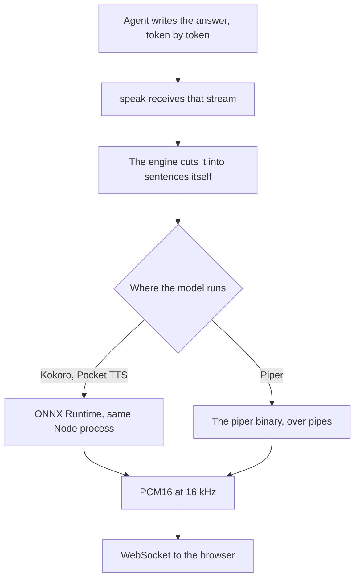

Running the voice locally removes the per-character bill, the network round trip, and the question of what a provider does with every sentence your assistant speaks. Three engines make that practical from a Node server today. Each one is the best on a different measure.

Pocket TTS speaks first, 250 to 430 ms after it is handed a sentence. Piper is the only one that goes beyond English, and it covers 43 languages in all. Kokoro installs in one npm command and asks for nothing else. Every number here comes from the measurements collected for the [local models guide](/docs/ai-integration/local-models), taken on a MacBook Pro M2 on CPU.

## What runs locally in Node today

| Engine                                                              | Runs                | Languages | First sound    | Voice comes from                     |
| ------------------------------------------------------------------- | ------------------- | --------- | -------------- | ------------------------------------ |
| [Pocket TTS](/docs/ai-integration/provided-integrations/pocket-tts) | In the Node process | English   | 250 to 430 ms  | A few seconds of reference audio     |
| [Piper](/docs/ai-integration/provided-integrations/piper)           | In a subprocess     | 43        | ~390 ms        | A voice file you download            |
| [Kokoro](/docs/ai-integration/provided-integrations/kokoro)         | In the Node process | English   | 900 to 1300 ms | A catalog bundled with the model     |

Two familiar options stay out of this comparison. The Web Speech API lives in the browser rather than in Node, and it is rarely local even there, since most platforms send the text to a server. The macOS `say` command ties you to one operating system and to the voices Apple ships with it.

## Kokoro and Pocket TTS run inside Node, Piper as a subprocess

Both in-process engines sit on ONNX Runtime, through different bindings. Kokoro arrives through [Transformers.js](https://huggingface.co/docs/transformers.js), which fetches its weights from Hugging Face on first use, so `npm install @micdrop/kokoro` is the whole setup. Pocket TTS goes through the [sherpa-onnx](https://k2-fsa.github.io/sherpa/onnx/tts/pocket.html) native addon, which ships prebuilt binaries, and asks you to download and extract a 98 MB archive once.

Piper asks for more. You install its binary with `pip install piper-tts` and download a voice as a pair of files. Micdrop then spawns the executable and talks to it over pipes: one utterance per line on standard input, raw PCM16 on standard output.



The three engines also differ in what you deploy. Kokoro adds a dependency to your `package.json` and nothing else. Pocket TTS adds an archive to fetch at build time. Piper adds a Python interpreter to your container image, a voice file to ship or download at boot, and a process to supervise.

Micdrop keeps that Piper process alive across sentences rather than spawning one per sentence, so the voice loads once. On an interruption it kills the process and starts the replacement at once. The replacement loads its voice while the user is still speaking, so it is ready by the time the next answer begins.

## Running one from Node

A Micdrop TTS is a small class you can drive on its own, with no server and no WebSocket. It takes a stream of text and emits PCM16 audio at 16 kHz, the rate the browser client expects.

```typescript
import { TTS } from '@micdrop/server'
import { createWriteStream } from 'fs'
import { PassThrough } from 'stream'

// Speaks one sentence and saves the audio to a file
function speak(tts: TTS, text: string, path: string) {
  const start = Date.now()
  const file = createWriteStream(path)
  let quiet: NodeJS.Timeout | undefined
  let first = true

  tts.on('Audio', (chunk) => {
    if (first) {
      console.log(`First sound after ${Date.now() - start} ms`)
      first = false
    }
    file.write(chunk)
    // No end event exists, so the file closes once the chunks stop coming
    clearTimeout(quiet)
    quiet = setTimeout(() => file.end(), 500)
  })

  const textStream = new PassThrough()
  tts.speak(textStream)
  textStream.end(text)
}
```

The three engines differ only in their constructor.

```typescript
import { KokoroTTS } from '@micdrop/kokoro'

speak(
  new KokoroTTS({ voice: 'britishFemale' }),
  'Hello, how can I help?',
  'kokoro.pcm'
)
```

```typescript
import { PiperTTS } from '@micdrop/piper'

speak(
  new PiperTTS({ modelPath: './voices/fr_FR-siwis-medium.onnx' }),
  'Bonjour, comment puis-je vous aider ?',
  'piper.pcm'
)
```

```typescript
import { PocketTTS } from '@micdrop/pocket-tts'

speak(
  new PocketTTS({ modelDir: './sherpa-onnx-pocket-tts-int8-2026-01-26' }),
  'Hello, how can I help?',
  'pocket.pcm'
)
```

Those files hold raw PCM16 at 16 kHz, the format the browser client expects, so `ffplay -f s16le -ar 16000 -ch_layout mono kokoro.pcm` plays one back. In a real integration you forward each chunk instead of writing it, which is what `MicdropServer` does when it pushes them onto the WebSocket as they arrive.

Audio comes back as a stream of chunks rather than as one buffer, so the first words are playable while the rest is still being generated. A TTS signals no end of utterance either, since the engine stops when the agent stops writing and the browser plays whatever reaches it. A consumer that needs a boundary draws its own, which is why that function closes the file on a timer.

Constructing an engine starts loading it, so a `speak` called on the very next line measures the load as well as the synthesis. Give it a second before the first call to reproduce the latency figures, or measure the second sentence instead.

`speak()` takes a `Readable` rather than a string because the agent writes its answer token by token. Each engine carries its own sentence splitter and synthesizes each sentence as soon as it is complete, so nothing upstream has to buffer the answer or cut it up first. Handing it a whole sentence at once is the simplest case.

<Callout type="tip" title="From one class to a whole conversation">
  [MicdropServer](/docs/server) wires this same object to a WebSocket, next to
  speech to text and an agent. The [local models
  guide](/docs/ai-integration/local-models) assembles a complete voice
  conversation that runs entirely on your machine, with Ollama for the agent and
  Whisper for the transcription.
</Callout>

## Latency, measured

| Measure                       | Pocket TTS           | Piper                     | Kokoro                    |
| ----------------------------- | -------------------- | ------------------------- | ------------------------- |
| First sound, model loaded     | 250 to 430 ms        | ~390 ms                   | 900 to 1300 ms            |
| Loading the model or voice    | ~470 ms              | ~1 s                      | ~1.5 s in `q8`            |
| Compute per second of audio   | ~0.2 s               | Far below real time       | 0.4 to 0.9 s              |
| Rest of a multi-sentence answer | Streamed as written | Almost free               | Same cost as the first    |

The three engines reach their first sound by different routes. Pocket TTS emits chunks while it is still generating the end of the sentence, so the user hears the opening words early. Piper spends almost all of its time on loading the voice. Micdrop pays that cost when you construct the `PiperTTS` instance, so every sentence after it costs almost nothing. Kokoro synthesizes a whole sentence before emitting it, which is why its first sound arrives about a second later than the other two.

That gap narrows on a long answer, because the reply goes out sentence by sentence and the user hears the opening while the rest is still being written. A short greeting is a single sentence, so nothing hides the gap. A local call answers in about a second with Pocket TTS or Piper and closer to two with Kokoro, and the person on the line hears that second.

The two in-process engines pay a graph warm-up on their first inference, so Micdrop runs one word through the model at startup. Leave `warmup` on and that cost lands while the call is being set up instead of while somebody waits.

## Piper covers 43 languages, the other two only English

Kokoro and Pocket TTS stop at English for different reasons.

Kokoro's upstream model, [Kokoro-82M](https://huggingface.co/hexgrad/Kokoro-82M), ships 54 voices across eight languages, French and Japanese included. `kokoro-js`, the JavaScript port Micdrop builds on, catalogs 28 of them, every one American or British English. The 26 others ship inside the package without ever being listed, and asking for one throws, because the library checks the id against its catalog before anything else. It then reads the language off the first letter of that id and maps it to `en-us` or `en`.

The espeak-ng port underneath speaks many more languages, which `kokoro-js` never asks it for. The Python stack reaches French the same way, through espeak-ng, since [misaki](https://github.com/hexgrad/misaki) carries native modules for English, Japanese, Korean, Chinese, Vietnamese and Hebrew alone.

Kyutai, the lab behind Pocket TTS, publishes French, German, Spanish, Italian and Portuguese checkpoints as well. None of them has an ONNX conversion, and sherpa-onnx publishes the English model alone, as a quantized archive and a full precision one. Hand it French and you get fluent nonsense.

Piper handles languages one voice at a time. Each voice is a small VITS model of a few dozen megabytes, trained on a single language, named after its language, its speaker and its quality: `fr_FR-siwis-medium`, `en_GB-alba-medium`, `de_DE-thorsten-high`. The project lists 43 languages, with [samples](https://rhasspy.github.io/piper-samples/) to listen to before you download one.

<Callout type="tip" title="Keep the voice and the agent in the same language">
  Pairing an English voice with an agent writing French leaves the voice reading
  French words with English phonemes, and nobody understands the result. Make the
  system prompt name the language the voice speaks.
</Callout>

## Memory and the CPU

Kokoro holds about 80 MB once loaded. Pocket TTS, a 100 million parameter model, holds 350 MB once loaded and rises to around 600 MB while it generates. Piper keeps its memory in a separate process, roughly the size of the voice file, a few dozen megabytes for a `medium` voice.

Put a whole stack together, with a 4B language model in `Q4`, Whisper `base` and Kokoro, and you hold around 4 GB. Latency limits a local call long before memory does on a 16 GB machine, so spend the spare gigabytes on a larger LLM rather than on a heavier transcription model.

Kokoro's `q8` quantized weights load in around a second and a half against 5.8 seconds for `fp32`, and they generate at the same speed, so quantization buys a faster start rather than faster speech.

All three stay on the CPU on a Mac. Transformers.js declares no GPU device on macOS, WebGPU does not exist in Node with or without a flag, and CoreML ran three to five times slower than the CPU, because it splits the graph into dozens of partitions and spends its time copying tensors between them. Piper's command line has a `--cuda` flag and no Metal equivalent. On Linux with an NVIDIA card all three have a GPU path worth trying, and the [latency and memory page](/docs/ai-integration/local-models/performance) carries those measurements.

## Piper's engine went GPL in 2025

The original `rhasspy/piper` repository was archived in October 2025 under the MIT license. Development moved to [OHF-Voice/piper1-gpl](https://github.com/OHF-Voice/piper1-gpl), maintained by the Open Home Foundation, under GPL-3.0. The new repository name says why. Piper now embeds espeak-ng for phonemization instead of reaching it through a separate library, and espeak-ng is GPL, so the engine became GPL with it.

Micdrop drives that binary as a subprocess over pipes instead of linking it into your application. The Free Software Foundation treats that arrangement as two separate programs. Redistributing the binary yourself puts you back under the GPL terms, so check what your deployment actually ships.

Kokoro and Pocket TTS carry permissive licenses on the code. Kokoro's weights are Apache 2.0, and Pocket TTS is MIT with its sherpa-onnx addon under Apache 2.0. The conditions sit on the voices instead. Piper's voices are licensed one by one, some restrictively by the project's own account, and Pocket TTS makes the consent of the person you clone a condition of use. Read the model card of the voice you pick rather than the license of the repository holding it.

## Which one to pick

Pick **Piper** as soon as the call happens in a language other than English. Kokoro and Pocket TTS speak English only. You pay for that with a Python interpreter in your image, a voice file to ship, and a GPL check on what you redistribute.

Pick **Pocket TTS** for an English call that has to answer fast, or that needs a specific voice. It speaks first, loads fastest, and clones a voice from a few seconds of audio with no training step. You pay 600 MB of memory while it generates and an archive to fetch at build time, and you need the consent of whoever you clone.

Pick **Kokoro** for an English call when you want the shortest setup. One npm dependency, no binary, no archive, no voice file. It costs roughly one extra second before the first word, which a person on a call hears.

Run more than one when the language changes from one call to the next. Micdrop takes a TTS instance per call, so an application serving English and French can hand each conversation the engine that suits its language.

All three plug into the same pipeline as the hosted providers, speech to text then agent then voice, so swapping between them, or from ElevenLabs to a local voice, changes one constructor. The [AI integrations page](/docs/ai-integration) lists every option side by side. The [getting started guide](/docs/getting-started) walks through a working call in about five minutes.

## Frequently asked questions

<FaqList>
  <FaqItem question="Is Piper TTS free?">
    Yes, and the terms changed in 2025. The engine now lives at OHF-Voice/piper1-gpl under GPL-3.0, after it absorbed espeak-ng, while the archived rhasspy/piper repository was MIT. Using it costs nothing either way. The GPL affects redistribution. Driving the binary as a subprocess, which is how Micdrop uses it, keeps your application separate from the engine, while shipping the engine inside your own distribution brings the GPL terms with it. The voices are licensed one by one and some are restrictive, so read the model card of the voice you download.
  </FaqItem>
  <FaqItem question="Can Kokoro speak French?">
    The upstream Kokoro-82M model holds French voices, and `kokoro-js` never lists them. It catalogs 28 voices, all American or British English, and it throws on any other id instead of mispronouncing the language. Pocket TTS is English only too, since its French checkpoint has no ONNX conversion. Use Piper for French. It covers 43 languages with voices trained one language at a time, such as `fr_FR-siwis-medium`.
  </FaqItem>
  <FaqItem question="What is the fastest local TTS?">
    Pocket TTS puts out its first sound after 250 to 430 ms, Piper after around 390 ms and Kokoro after 900 to 1300 ms, measured on a MacBook Pro M2 on CPU with the model loaded. Pocket TTS also loads fastest, in about 470 ms. Speed alone rarely settles the choice, since Pocket TTS and Kokoro speak English only, so a call in another language goes to Piper whatever the numbers say.
  </FaqItem>
  <FaqItem question="Does local text to speech need a GPU?">
    None of the three needs one. Every measurement in this article comes from a laptop CPU, and on a Mac the CPU is the fastest path available, since Transformers.js exposes no GPU device on macOS and CoreML ran three to five times slower. On Linux with an NVIDIA card, Kokoro takes `device: 'cuda'`, Pocket TTS takes `provider: 'cuda'` and Piper has a `--cuda` flag. Measure all three on the hardware you deploy to.
  </FaqItem>
</FaqList>
