Picking a voice agent framework in 2026 means choosing what you are willing to operate. One project hands you a media server and a phone network. Another hands you three interfaces and gets out of the way. The gap between those two answers is much larger than the feature tables suggest, and it decides how much of your week goes into plumbing.

Micdrop publishes this ranking, and Micdrop appears in it at number three. That is worth knowing before you read the ranking. Every competitor here links to its own site, the figures come from each project's own repository, licence file and pricing page, and the criteria say plainly where Micdrop places last.

Thirteen projects are ranked, in two separate groups. The first nine are open source frameworks you run yourself. The last four are hosted platforms, kept apart because comparing a library you install with a service you rent on the same scale produces nonsense. A framework has no price per minute. A platform has no repository to read.

Everything here was read on 13 August 2026, and the Dograh entry on 16 August 2026. Voice moves fast enough that some of it will have shifted by the time you get there.

## How the thirteen were judged

Seven criteria are applied to the nine frameworks, and each entry reports the ones that separate it from its neighbours.

- The server-side language is taken from the project's own documentation, since a client SDK in a language says nothing about what the orchestration runs on.
- What you have to operate covers the media server, the worker process or the separate Python service each project adds to your deployment.
- The licence is read as written, including the conditions some projects attach to an otherwise permissive one.
- Provider independence asks whether speech-to-text, the model and text-to-speech are swappable.
- Reach counts telephony, video, mobile and embedded targets.
- Activity and community come from stars, contributors, download volume and release cadence.
- Public production evidence means named customers confirmed on a first-party page. Several well-known projects have none, and the entries say so where it applies.

The order is a different question, and no weighted sum of those seven produces it. The nine frameworks are ordered by **how many projects each one is the right default for**. LiveKit Agents and Pipecat come first because they fit almost any voice project, whatever the language or the channel. Micdrop comes third because the shape it fits, a voice mode inside a TypeScript web application, is a very common one, and only two other projects here cover it. Below that sit the projects that are excellent inside a narrower boundary: a single model vendor for the OpenAI Agents SDK, which covers that same shape and asks you to buy the whole pipeline from OpenAI, then a deployed platform rather than a library for Dograh, a restrictive licence for TEN, video for Vision Agents and telephony infrastructure for Jambonz. Vocode is last because it stopped shipping. A ranking by community size alone would run in a different order, and most entries give you the numbers to build that one instead.

Activity and public production evidence both cut against the project publishing this article, so they deserve a paragraph of their own rather than a line buried inside an entry. Micdrop is by a wide margin the smallest and youngest entry in this ranking, with a community a fraction of the size of Pipecat's or LiveKit's and no customer page to point at. It also ships no infrastructure of its own. The media server, the phone numbers, the managed plan and the support desk all sit outside the packages, which one maintainer writes. Those limits apply to every use case in this ranking, and not only to the ones where they are convenient to mention.

Some well-known names are deliberately absent. General TypeScript agent frameworks appear in a lot of 2026 voice lists and do not belong there. Mastra's own documentation hands the audio loop to LiveKit for voice activity detection, turn detection and barge-in, and VoltAgent's voice package wraps speech-to-text and text-to-speech rather than running a conversation. Voiceflow is left out for the same reason: voice is a phone channel on a chat-first design canvas, with no barge-in, turn-taking or voice activity controls exposed at all.

## The comparison at a glance

| Project | Server language | Transport | You operate | Telephony | Licence | Managed option |
|---|---|---|---|---|---|---|
| **LiveKit Agents** | Python, Node | WebRTC (SFU) | Media server, worker | Yes, SIP | Apache 2.0 + model licence | LiveKit Cloud |
| **Pipecat** | Python | WebRTC, WebSocket | Python service | Yes, 6 carriers | BSD 2-Clause | Pipecat Cloud |
| **Micdrop** | TypeScript | WebSocket | Your existing Node server | No | MIT | None |
| **OpenAI Agents SDK** | Node, Python | WebSocket, WebRTC | Your existing server | Yes, SIP | MIT | OpenAI Realtime API |
| **Dograh** | Python | WebRTC, WebSocket | Docker stack | Yes, 6 carriers | BSD 2-Clause | Dograh Cloud, private VPC |
| **TEN Framework** | Python, Go, C++, Node | RTC (Agora), WebSocket | Graph runtime | Yes, SIP | Apache 2.0 with conditions | Agora engine |
| **Vision Agents** | Python | WebRTC (Stream) | Python service | Yes, Twilio or Telnyx | Apache 2.0 | Stream edge network |
| **Jambonz** | Node | SIP, WebSocket | Full telecom stack | Yes, its speciality | MIT | Jambonz Cloud |
| **Vocode** | Python | WebSocket | Python service | Yes, Twilio and Vonage | MIT | Discontinued |
| **Vapi** | Hosted | WebRTC (Daily) | Nothing | Yes | Proprietary | $0.05/min + providers |
| **Retell AI** | Hosted | WebRTC (LiveKit) | Nothing | Yes, broad CCaaS | Proprietary | $0.07 to $0.31/min |
| **Bland** | Hosted | WebSocket | Nothing | Yes | Proprietary | $0.11 to $0.14/min |
| **Synthflow** | Hosted | WebSocket | Nothing | Yes, own carrier | Proprietary | ~$0.15 to $0.24/min |

## Open source frameworks you run yourself

### 1. LiveKit Agents

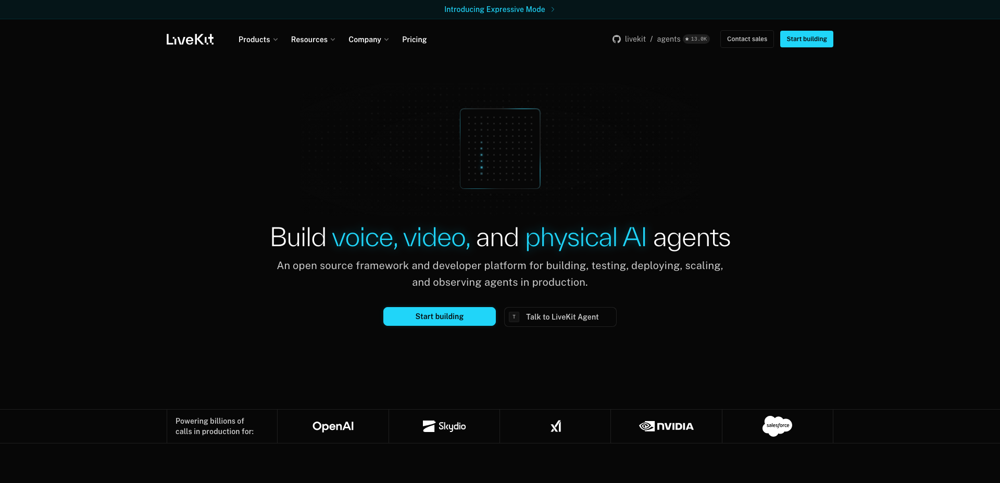

[LiveKit](https://livekit.io) is a WebRTC media server with an agent framework on top, and it is the broadest answer on this list. The framework is Apache 2.0, the Go media server is Apache 2.0, and so is the SIP gateway. The Python agents repository sits near 13,000 stars with 446 contributors and over a million PyPI downloads a week. The company raised a $100M Series C in January 2026 at a $1B valuation, led by Index Ventures.

The production evidence is the strongest in the field and it is public: OpenAI runs ChatGPT's voice mode on it, alongside SAP, NVIDIA, Tesla, Spotify and Salesforce on LiveKit's own customer page. Client SDKs cover JavaScript, React, Swift, Kotlin, Flutter, React Native, Unity, Rust, C++ and ESP32, which no other project here matches.

The Node distribution is first class in the documentation, with its own starter template alongside the Python one. It carries roughly 37 plugins against Python's 72, and MCP support is still marked Python only in the tool documentation. The semantic turn-detection models also ship under a separate LiveKit Model License stating they may only be used together with the LiveKit Agents framework, never standalone or with another framework. Self-hosting loses that turn detector along with the noise cancellation plugin. LiveKit Cloud opens free, then $50 and $500 a month, with agent minutes at $0.01 on top.

### 2. Pipecat

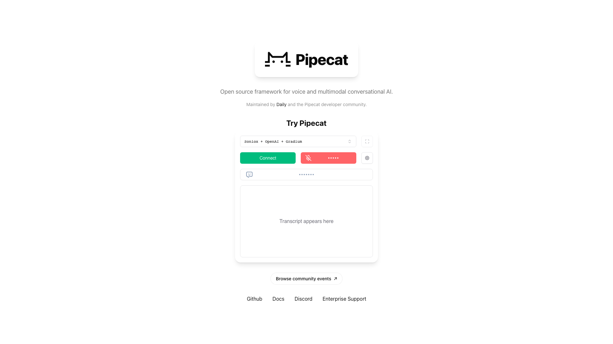

[Pipecat](https://pipecat.ai), from Daily, is the reference Python framework and the most starred framework built for voice here: 14,000 stars, 293 contributors, over 300,000 PyPI downloads a week, and a release every two or three weeks since 1.0 landed in April 2026. That 1.0 is only four months old, so the stable API is younger than the project.

Its licence is the cleaner of the two leaders. Pipecat is BSD 2-Clause, and so is its smart-turn detection model, so nothing about turn detection binds you to the framework that trained it. That single detail is a real advantage over LiveKit for anyone who cares where their models can run.

Pipecat carries ten transports, among them WebSocket and three flavours of WebRTC, plus first-party telephony serializers for Twilio, Telnyx, Plivo, Exotel, Genesys and Vonage, and SIP with call transfers. Client SDKs reach JavaScript, React, React Native, Swift, Kotlin, C++ and ESP32. Pipecat Cloud went generally available in January 2026 at $0.01 to $0.03 per agent minute, with PSTN at $0.018.

The framework is Python only, and its own README says so in the first line. Every TypeScript repository in the organisation is a client or a tool. A Node team therefore runs a second service in a second language. Pipecat publishes no named production customers, a gap that stands out given how often it is described as the industry default.

### 3. Micdrop

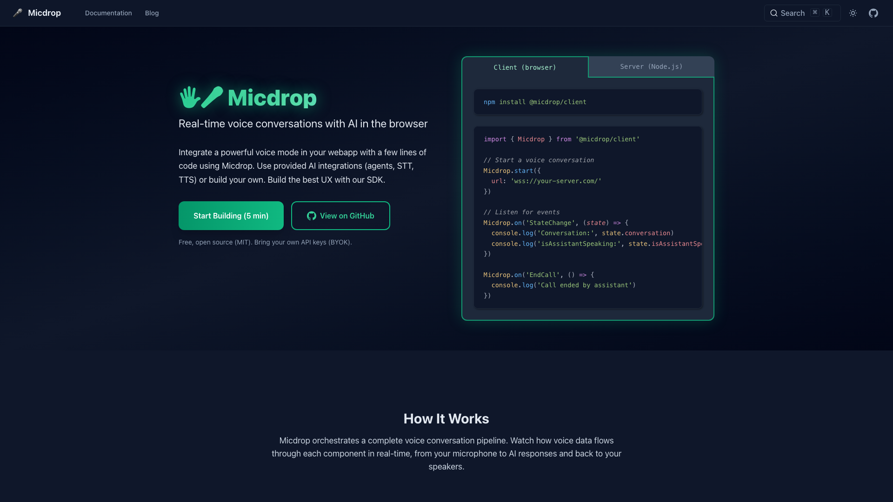

[Micdrop](https://micdrop.dev) is here because of a gap that almost every other project leaves open. Adding a voice mode to a web application normally costs at least one of three things: a second service to deploy, a media plane to operate, or a per-minute fee stacked on your provider bills. Micdrop asks for none of the three. The browser calls `Micdrop.start({ url })`, the server hands its existing socket to `new MicdropServer(socket, options)`, and the conversation runs inside the application you already ship, on the providers you already pay.

The MIT-licensed TypeScript packages carry the microphone, [voice activity detection](/docs/client/vad) and playback in the browser, the model, speech-to-text and text-to-speech on the server. Behaviours that usually cost a sprint are options here. [Provider fallback](/docs/ai-integration/fallback-strategies/tts-fallback) replays buffered text on a second vendor when the first one fails, [semantic turn detection](/docs/server/semantic-turn-detection) asks the model whether the user actually finished, and a [fully European stack](/docs/ai-integration/sovereign-voice-ai) runs on Mistral, Gladia and Gradium without touching orchestration code. Ten packages have shipped continuously since 2025, past their 2.0.

One other project avoids the same three costs. With the OpenAI Agents SDK, either the browser talks straight to OpenAI and your server drops out of the conversation, or you keep the server in the loop and write the audio capture and playback yourself, and either way the model, the transport and the bill come from one vendor.

Products such as [Raconte](https://raconte.ai), for voice interviews led by an AI, and [Cibli](https://cibli.fr), for recruitment where candidates answer out loud, run Micdrop in production, though Raconte is built by Micdrop's own maintainer and neither publishes a case study. Telephony, video, a mobile SDK, managed hosting and a customer page are all absent, the community is the smallest in this ranking by a wide margin, and Pipecat and LiveKit beat it on every criterion that involves reach, adoption or the size of the team behind the code.

### 4. OpenAI Agents SDK

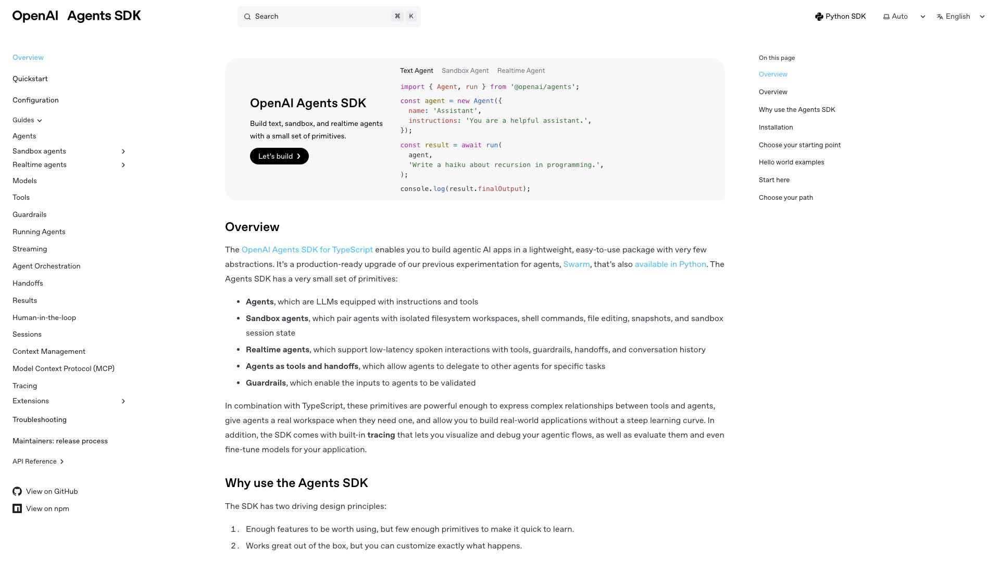

The [OpenAI Agents SDK](https://openai.github.io/openai-agents-js/) is MIT-licensed, ships for both TypeScript and Python, and its realtime layer runs on a server. The transport guide is explicit that WebSocket is the default server choice, suited to server-side use cases, telephony bridges and custom audio pipelines, while WebRTC is the browser default. On that path you own the audio capture and playback and the SDK owns the event loop, tools, guardrails and history. The Python SDK sits above 28,000 stars, the JavaScript one near 3,600, and both ship a release most weeks.

The trade is the vendor, not the language. The realtime path is OpenAI's speech-to-speech model rather than an assembled pipeline, so there is no separate speech-to-text and text-to-speech chain to point elsewhere. Every shipped realtime transport targets OpenAI's own API, and the adapter that makes text agents provider-agnostic does not apply to realtime agents. Swapping providers means implementing the transport layer yourself. Telephony is covered, with a native SIP transport for phone calls and a Twilio transport still flagged as beta. Pricing is metered per token on the Realtime API, at $32 per million audio input tokens and $64 per million output, which comes to roughly ten cents a minute of conversation. Both SDKs are still pre-1.0 after seventeen months.

### 5. Dograh

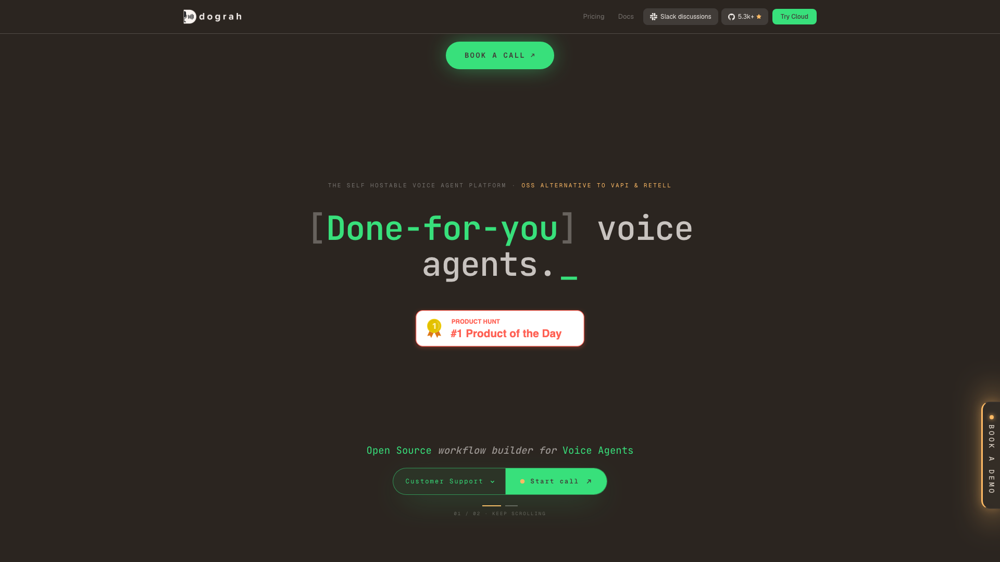

[Dograh](https://www.dograh.com) is the one entry here shaped like a platform rather than a library, and it answers the question the hosted platforms keep raising: what if you want the dashboard, the workflow builder and the phone numbers without renting them. It is BSD 2-Clause throughout, self-hosts with one Docker command, and adds a managed cloud plus a private VPC deployment for teams that want the operations handled. Telephony matches the broadest in the open source group, with Twilio, Vonage, Telnyx, Plivo, Cloudonix and Asterisk integrations, and bring-your-own-key covers speech-to-text, the model, text-to-speech and the carrier, on either a cascaded pipeline or a speech-to-speech one.

The activity is real rather than announced: 5,365 stars and 1,299 forks since the repository opened in September 2025, 58 contributors, and five releases in the five weeks to 11 August 2026. It ships an MCP server so agents can be built from a coding assistant, and it is explicit about air-gapped deployments where no transcript or recording leaves your network. Two caveats come with it. It is a Python backend, so a Node team operates it as a separate service rather than embedding it, which is the same trade Pipecat asks for. And no named production customer appears on the site or the repository, which puts it with most of this list rather than apart from it.

### 6. TEN Framework

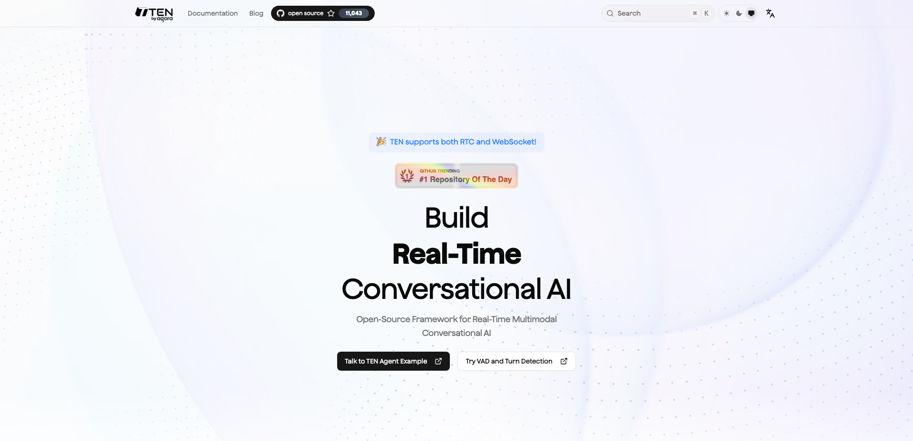

[TEN](https://theten.ai), backed by Agora, is one of the most active projects in the field: 11,000 stars, a release roughly every two weeks, and commits landing daily. It is a polyglot graph runtime where Go, Python, C++ and Node extensions share one message bus, with its own voice activity detection and turn-detection models, multimodal video streams and a visual designer. It is also the renamed Astra, so lists that rank both are counting one project twice.

Read the licence carefully. GitHub declines to classify it as a standard licence, because it is Apache 2.0 with additional conditions. The text forbids hosting the framework on end-user devices, mobile terminals included, and forbids deployment in a way that competes with Agora's offerings or lets others compete with them. Since Agora sells a conversational AI engine, the non-competition clause plausibly rules out building a voice platform business on TEN. Only the `packages/` directory is unrestricted. The framework is also still on 0.x after two years, so no API stability is promised, and no named production users appear anywhere on the project's site, README or press material.

### 7. Vision Agents

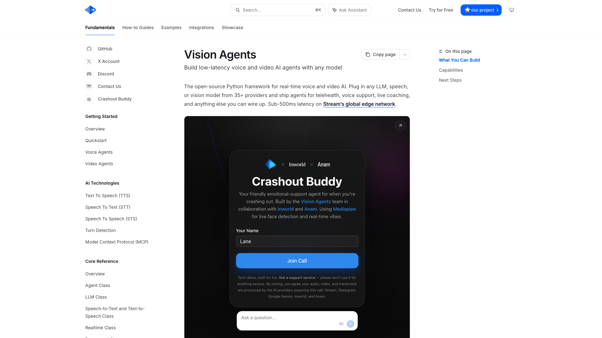

[Vision Agents](https://visionagents.ai), from Stream, is a year old and already past 8,000 stars, with weekly releases and Apache 2.0 throughout. It is provider-agnostic across speech-to-text, text-to-speech, models and speech-to-speech, and runs WebRTC over Stream's edge network with a free tier of 333,000 participant minutes a month. Client SDKs cover React, Android, iOS, Flutter, React Native and Unity, and telephony arrives through Twilio or Telnyx.

What sets it apart is vision. These are agents that watch a video stream rather than only listening to one, which opens telehealth, live coaching and anything where the model needs to see what the user sees. The framework is Python only, with no Node server path, and it remains pre-1.0 with no named production users published.

### 8. Jambonz

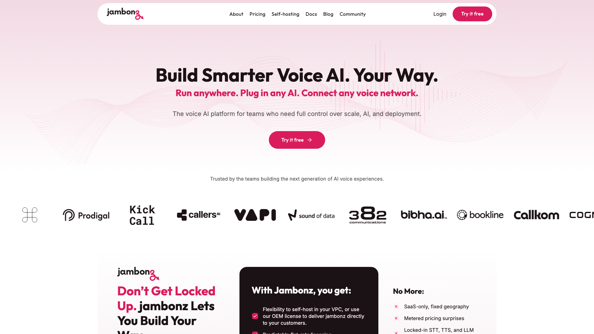

[Jambonz](https://jambonz.org) is the answer to "is there a mature Node.js voice project". It is MIT, written in JavaScript, maintained by FirstFive8 since 2019, and still shipping in August 2026. It is also telecom infrastructure rather than a browser voice framework: SIP trunks, carrier-grade routing, media control, and swappable speech and model vendors underneath.

Its user list is unusual, because two platforms ranked here run on it: Retell AI and Vapi, alongside Cognigy, Rasa and Movius. If you are building phone-first agents in Node and want to own the telecom layer, this is the project, and it complements rather than competes with anything that handles the browser leg. Star counts understate it badly, since the work is spread across about thirty repositories, and that spread is also the warning. Adopting Jambonz means running a telecom stack, with the SIP knowledge and the operational surface that implies, which is a great deal more to carry than a voice library if all you wanted was a browser talking to your backend.

### 9. Vocode

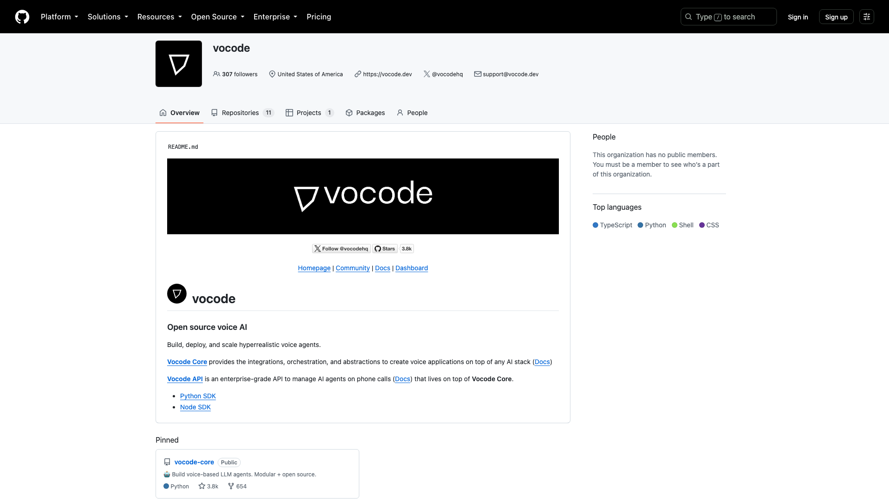

[Vocode](https://github.com/vocodedev/vocode-core) is MIT, Python, a Y Combinator W23 company, and still ranked fourth to sixth in most 2026 lists out of habit. It earned that reputation: 3,800 stars, a clean FastAPI telephony server with Twilio and Vonage support, and one of the first credible open source answers to voice agents.

It has not moved since November 2024. The last stable release is from June 2024, `vocode.dev` now redirects to the GitHub organisation, the hosted API's subdomains have no DNS records at all, and Y Combinator's own company page marks Vocode as acquired without naming an acquirer. The repository is not archived and the documentation carries no deprecation notice, so it still looks alive from a search result. It is ranked here so the picture is complete, and it is the clearest evidence that a permissive licence and a healthy star count say nothing about whether a project will still build next year.

## Hosted platforms, for comparison

These four are rented rather than run. None of them is open source. Three ship what the documentation calls a server SDK, a typed REST client rather than an orchestrator, and Synthflow ships only a REST API you call yourself. The voice loop stays on their infrastructure.

Most of the seven criteria cannot be applied to a platform with no repository to read, so these four are ordered on the one axis that stays measurable: how much of the stack you keep control of, from Vapi where you can supply your own model keys down to Synthflow where there is no self-hosting and no SDK at all.

### 10. Vapi

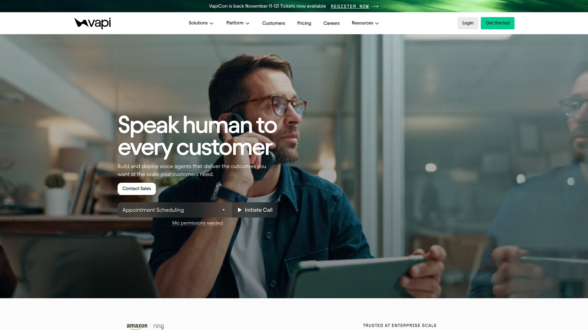

[Vapi](https://vapi.ai) is the closest hosted analogue to the philosophy of the self-hosted frameworks, because it supports bringing your own keys: the platform fee is $0.05 a minute and model providers are billed at cost, or at zero if you supply the credentials. It raised a $50M Series B in May 2026 at around a $500M valuation, has handled over a billion calls, and publishes real logos including Amazon Ring, which routes all of its inbound calls through it. It carries SOC 2, GDPR and PCI DSS, and it is the only one of the four pairing an SLA figure, at 99.9%, with a public status page.

The orchestration engine has no public repository, the browser transport is WebRTC through Daily, and adding speech and model bills puts realistic all-in cost between $0.23 and $0.33 a minute. HIPAA is a $2,000 monthly add-on.

### 11. Retell AI

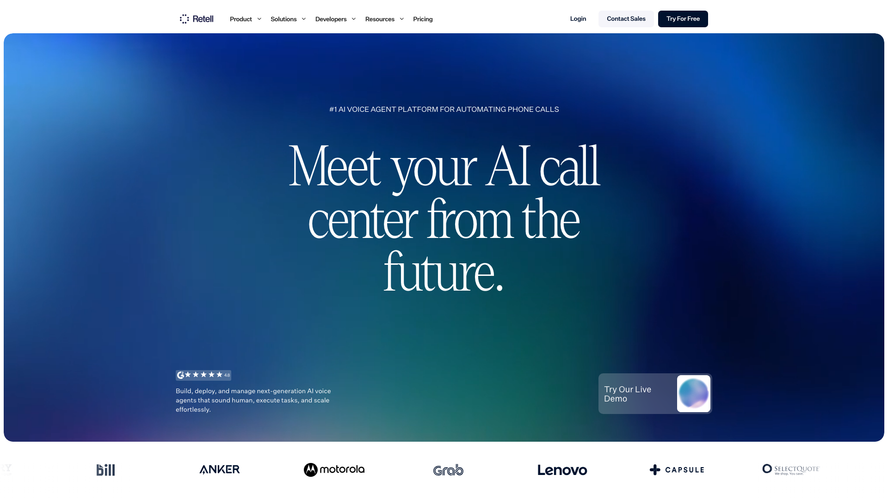

[Retell AI](https://www.retellai.com) is the capital-efficiency story of the group: a $4.6M seed and no Series A, against $60M of annualised revenue reported in April 2026, growing 650% year on year, and profitable. It handles more than 50 million calls a month. Its verified SIP integrations are the deepest here, covering Twilio, Telnyx, Vonage, Avaya, Genesys Cloud, Five9 and Amazon Connect, and its SDKs are Apache 2.0 even though the core is closed.

Pricing is unbundled despite the single headline range of $0.07 to $0.31 a minute, adding voice infrastructure at $0.055 a minute to text-to-speech, telephony and a per-minute model line, which lands near $0.245 for a frontier model over Twilio. Retell's compliance documentation states plainly that it operates no services within the European Union, and all of its case studies are anonymised, with no named customer logos published.

### 12. Bland

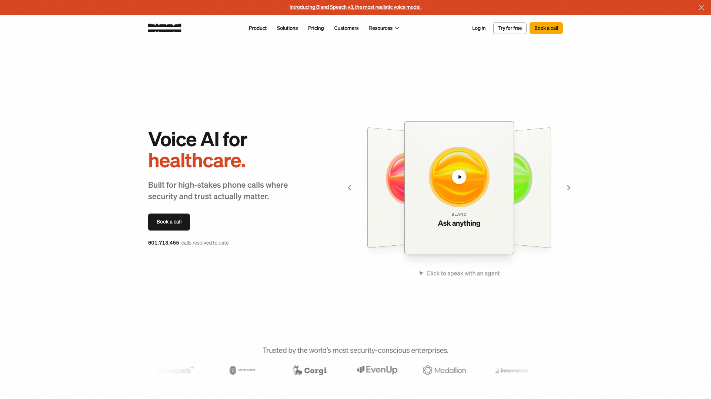

[Bland](https://www.bland.ai) runs its own GPUs and its own model, speech-to-text and text-to-speech stack rather than wrapping third-party APIs, which makes it the most vertically integrated option and the only one with no bring-your-own-key story at all. Pricing is fully bundled in exchange: $0.14 a minute with no platform fee, down to $0.11 on a $499 monthly plan, with speech and model usage included. On a frontier model that works out cheaper all-in than Retell.

It raised a $50M Series C in June 2026 led by Dell Technologies Capital, serves more than 250 enterprise customers including Samsara and CNO Financial Group, and is the only platform of the four documenting a customer-side VPC deployment with zero data egress, on enterprise contracts. One caution on wording: Bland's documentation describes itself as "fully self hosted", which means Bland hosts its own hardware rather than that you can host Bland. Its published scale figures also conflict between its own site and press coverage.

### 13. Synthflow

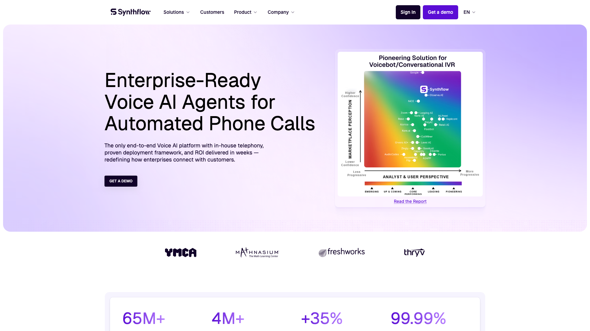

[Synthflow](https://synthflow.ai) is the one hosted vendor with EU hosting of its own. The company is AgentFlow AI GmbH, registered in Berlin, and it publishes EU and US hosting regions, ISO 27001, SOC 2, GDPR, HIPAA, PCI DSS, a 99.99% SLA and an EU AI Act transparency statement. It runs its own carrier network with regional points of presence, integrates with a dozen named contact-centre platforms including Five9, Genesys Cloud, Talkdesk, RingCentral and Zoom, and handles over 10 million calls a month across 30 countries for customers including Freshworks and Thryv.

There is no self-hosting and no SDK. The documented surface is a REST and streaming API, and what the marketing calls a WebSocket SDK is a protocol you implement yourself from copy-paste samples. The pricing page now publishes a single number: enterprise contracts start at $30,000 a year. The component rates that blend out to roughly $0.15 to $0.24 a minute come from third-party sources that agree with each other rather than from Synthflow directly.

## How to choose between them

Start from what you refuse to operate, because that eliminates most of the list in one step.

If voice is your product and it involves phone numbers, video or a dozen client platforms, **LiveKit Agents or Pipecat** are the two serious answers, and the choice between them comes down to language and licence. Python teams take Pipecat and get the cleaner licence with no model carve-out. Teams that want a managed media plane with observability take LiveKit and pay per minute for it.

If your backend is Node and the voice feature lives inside a web application you already ship, three projects qualify: **LiveKit Agents, the OpenAI Agents SDK and Micdrop**. Separate them on two questions. Does a WebRTC media plane earn its keep for a one-to-one call between a browser and your own server, and are you willing to buy the model, the transport and the bill from one vendor? LiveKit brings a much larger community, telephony and a managed option, at the cost of an SFU and a worker process. The OpenAI Agents SDK is the least code of the three and the shortest path if you have already committed to OpenAI. Swapping any part of the pipeline means writing a transport layer yourself. Micdrop brings a WebSocket into the server you already run with three swappable provider slots, at the cost of telephony, a media plane and a large community. We wrote the long version separately, [against LiveKit Agents](/blog/alternative-to-livekit-agents) and [against Pipecat](/blog/alternative-to-pipecat).

If phone calls are the whole product, look at **Jambonz** to own the telecom layer in Node, or at a hosted platform to skip it entirely. Regional needs change the answer again. Outside the thirteen ranked here, Bolna is MIT, actively released and built around Indian-language telephony, which none of the leaders cover well.

If what you want is a hosted platform without the hosting, **Dograh** is the only entry in this list built for that. You get the dashboard, the workflow builder and the carrier integrations as a Docker stack on your own machines, under a permissive licence, and you accept operating a Python service and its dependencies to have them. Weigh it against the hosted four on operations rather than on features, since that is where the difference actually lands.

Among the hosted four, the deciding question is where your money and your data go. **Vapi** is the one that separates the platform fee out, at $0.05 a minute, and lets you keep your own provider contracts. **Bland** is simplest to forecast because everything is included, and impossible to unbundle. **Retell** has the deepest verified SIP integrations and no European presence. **Synthflow** is the one to shortlist when EU hosting is a requirement and a $30,000 annual floor is acceptable.

Two questions get skipped at selection time and asked in production. What happens when your text-to-speech provider goes down in the middle of a call? What happens to the conversation when the user pauses mid-sentence? Provider fallback and turn detection both deserve a test while you still have the choice.

## Frequently asked questions

<FaqList>
  <FaqItem question="Is there a good open source voice AI agent framework?">
    Yes, and there are several. Pipecat (BSD 2-Clause, Python) and LiveKit Agents (Apache 2.0, Python and Node) are the two most complete and most widely used. TEN Framework and Vision Agents are very active alternatives, Dograh (BSD 2-Clause) is the one shaped like a self-hostable platform with a visual workflow builder and telephony rather than a library, and Micdrop, a much smaller project, covers the narrower case of a voice conversation inside a TypeScript web application. All of them are free to run on your own infrastructure, and you pay only your speech and model providers.
  </FaqItem>
  <FaqItem question="What is the best open source voice agent framework?">
    There is no single best one, because the projects target different kinds of application. Pipecat is the best default for a Python backend, LiveKit Agents for anything needing WebRTC, telephony, video or many client platforms, and Micdrop for adding voice to a Node and TypeScript web app without running a media server. Community size argues for the first two: Pipecat and LiveKit each carry more than 10,000 stars and hundreds of contributors, while Micdrop is a young project with one maintainer. Choose on the language your backend already speaks, on what infrastructure you are prepared to operate, and on how much you need a large community behind the code.
  </FaqItem>
  <FaqItem question="What is the best open source voice model?">
    Whisper is the open default for speech to text. Outside English, a checkpoint fine-tuned on the language does better than a heavier generic one on both accuracy and cost. For speech synthesis, Piper is the only open engine covering around forty languages, while Pocket TTS and Kokoro speak English only. Piper needs its binary downloaded and Pocket TTS its weights archive extracted. Kokoro is the one that installs with npm alone. Each of these is a model your framework calls, so swapping one for another leaves the rest of the pipeline alone. The [local models guide](/docs/ai-integration/local-models) has the measurements, taken on a MacBook rather than a GPU server.
  </FaqItem>
  <FaqItem question="Can I build a voice AI agent entirely in TypeScript?">
    Yes, though only three projects qualify. LiveKit Agents ships a Node distribution with roughly half the plugin catalogue of its Python side, the OpenAI Agents SDK runs a server-side voice loop over WebSocket if you use OpenAI's realtime model, and Micdrop is TypeScript on both the browser and the server with swappable providers, though it is much the smallest and youngest of the three. Everything else labelled a Node or TypeScript SDK by a voice vendor is a REST client that calls a service running the conversation elsewhere.
  </FaqItem>
  <FaqItem question="How much does an AI voice agent cost per minute in 2026?">
    On a hosted platform, expect $0.05 a minute of platform fee with Vapi plus your provider bills, around $0.07 to $0.31 with Retell depending on the model, $0.11 to $0.14 all-inclusive with Bland, and roughly $0.15 to $0.24 with Synthflow. On a self-hosted framework you pay speech-to-text, the model and text-to-speech directly at each provider's list price, with no per-minute layer added on top, so the total depends entirely on which providers you pick.
  </FaqItem>
  <FaqItem question="Do I need WebRTC to build a voice agent?">
    No. WebRTC exists because many-to-many media is hard, and a browser talking to your own backend is a one-to-one connection. A WebSocket carries that traffic through standard load balancers and reverse proxies with no SFU, no TURN server and no ICE negotiation, provided voice activity detection runs in the browser so you send audio only while someone is speaking. WebRTC earns its complexity when you add phone calls, video or several human participants in the same room.
  </FaqItem>
  <FaqItem question="Are open source voice agent frameworks really free?">
    The framework is free, and the conversation is not. Every project here calls speech-to-text, a language model and text-to-speech that bill per minute or per token, so your running cost follows those providers rather than the framework. Two things to check in the licence: TEN Framework adds conditions that forbid deployment on end-user devices and uses that compete with Agora, and LiveKit's turn-detection models may only be used inside LiveKit Agents even though the framework itself is Apache 2.0.
  </FaqItem>
  <FaqItem question="Can I keep voice data inside the European Union?">
    With a self-hosted framework, yes, since you choose both where the server runs and which providers it calls. A fully European pipeline is available today by combining Mistral for the model, Gladia for speech-to-text and Gradium for text-to-speech. Among hosted platforms, Synthflow publishes an EU hosting region, while Retell's own compliance documentation states that it operates no services within the European Union.
  </FaqItem>
  <FaqItem question="Is Vocode still maintained?">
    No. The last commit to vocode-core dates from November 2024 and the last stable release from June 2024, the vocode.dev domain now redirects to the GitHub organisation, and Y Combinator lists the company as acquired. The repository is neither archived nor marked deprecated, so it still appears healthy in search results and in listicles that have not been rechecked. Treat it as a reference implementation rather than a dependency.
  </FaqItem>
</FaqList>

## Getting started

Pipecat and LiveKit Agents are the two projects most teams should look at first, and they ask you to adopt a Python service or a WebRTC media plane in exchange for what they cover. That trade is worth it for phone calls, video and scale. It is a lot of machinery for a voice mode inside a web app.

That narrower case is what Micdrop is for, in TypeScript on both sides, over a WebSocket to the server you already deploy:

```bash
npm install @micdrop/server @micdrop/client @micdrop/openai @micdrop/gladia @micdrop/elevenlabs
```

The [Getting Started guide](/docs/getting-started) has a working call running in about five minutes, and the [React hooks](/docs/client/react-hooks) cover the UI states you will want to render.

<RankingJsonLd
  name="Best open source voice AI agent frameworks in 2026"
  description="Open source voice agent frameworks you run on your own infrastructure, ranked in August 2026."
>
  <RankingEntry name="LiveKit Agents" url="https://livekit.io" />
  <RankingEntry name="Pipecat" url="https://pipecat.ai" />
  <RankingEntry name="Micdrop" url="https://micdrop.dev" />
  <RankingEntry name="OpenAI Agents SDK" url="https://openai.github.io/openai-agents-js/" />
  <RankingEntry name="Dograh" url="https://www.dograh.com" />
  <RankingEntry name="TEN Framework" url="https://theten.ai" />
  <RankingEntry name="Vision Agents" url="https://visionagents.ai" />
  <RankingEntry name="Jambonz" url="https://jambonz.org" />
  <RankingEntry name="Vocode" url="https://github.com/vocodedev/vocode-core" />
</RankingJsonLd>

<RankingJsonLd
  name="Hosted voice AI agent platforms in 2026"
  description="Managed voice agent platforms compared alongside the open source frameworks, ranked in August 2026."
>
  <RankingEntry name="Vapi" url="https://vapi.ai" />
  <RankingEntry name="Retell AI" url="https://www.retellai.com" />
  <RankingEntry name="Bland" url="https://www.bland.ai" />
  <RankingEntry name="Synthflow" url="https://synthflow.ai" />
</RankingJsonLd>
