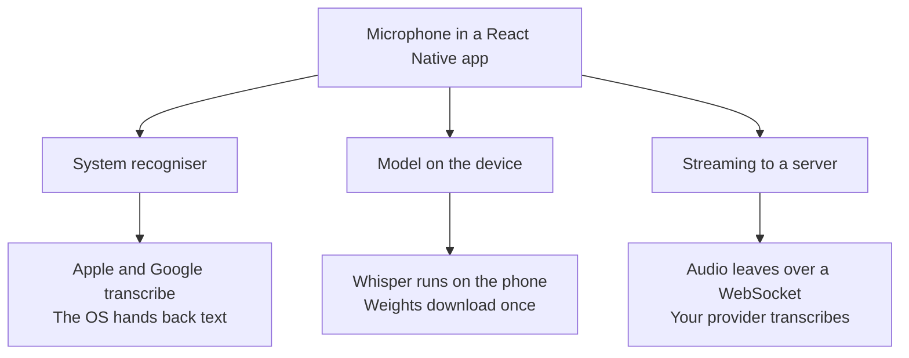
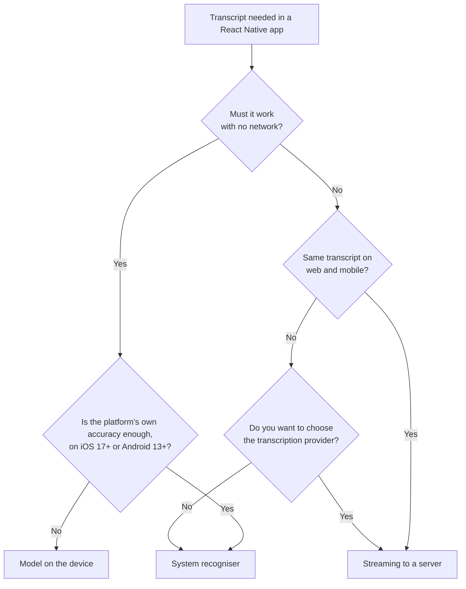
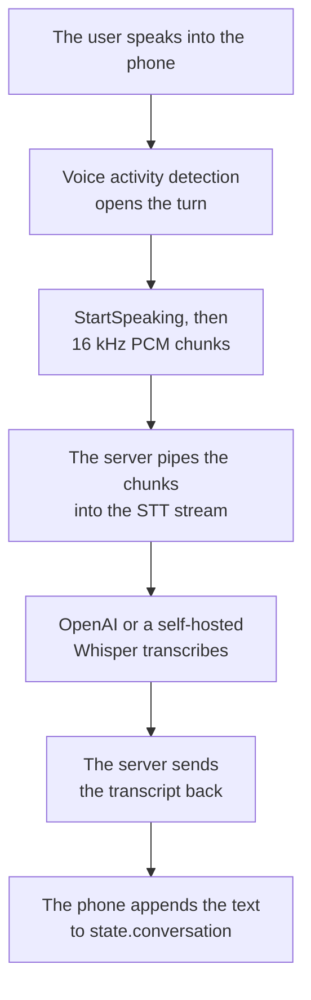

Your React Native app needs the words a user just said. The three routes to them differ far more than the packages behind them suggest, so the difference shows up late: on the second platform, or the week someone asks why the web version and the mobile version disagree on the same sentence.

## Three routes from speech to text on a phone

The first route calls the speech recogniser built into iOS and Android, through `expo-speech-recognition`. The second runs a model such as Whisper on the phone itself, through `react-native-executorch` or `whisper.rn`. The third streams the microphone to a transcription server over a WebSocket and reads the text back.



Ask three questions to tell them apart: who owns the model and therefore decides how good the transcript is, where the audio goes, and how much the app has to ship, from a native module alone to hundreds of megabytes of weights.

## expo-speech-recognition calls the recogniser already on the phone

`expo-speech-recognition`, maintained by jamsch, wraps the iOS `SFSpeechRecognizer`, the Android `SpeechRecognizer` and the Web Speech API behind one interface. It gets more than half a million downloads a week. Since `@react-native-voice/voice` was archived and its README now points here, `expo-speech-recognition` has become the community answer for React Native speech recognition.

```tsx
import {
  ExpoSpeechRecognitionModule,
  useSpeechRecognitionEvent,
} from 'expo-speech-recognition'

useSpeechRecognitionEvent('result', (event) => {
  setTranscript(event.results[0]?.transcript)
})

const handleStart = async () => {
  await ExpoSpeechRecognitionModule.requestPermissionsAsync()
  ExpoSpeechRecognitionModule.start({
    lang: 'en-US',
    interimResults: true,
    continuous: true,
  })
}
```

That is the whole integration. The package contains native code, so the app runs from a development build rather than from Expo Go. No model ships with it though, and nothing gets billed, since the recogniser is already on the phone.

You are borrowing two products, Apple's recogniser and Google's, and their results differ in ways you have to code around. Word confidence and timing come back on iOS, and on Android only with on-device recognition, from version 14. That same version detects the language, which iOS never does. Android 12 and below has no continuous mode, so you restart a long dictation by hand. Android also plays a beep when recognition starts and stops, a hardcoded behaviour of the underlying `SpeechRecognizer` that you work around by keeping the session continuous, as the README suggests.

Offline recognition depends on what the user downloaded. The `requiresOnDeviceRecognition` option defaults to `false`, so audio goes to Apple's or Google's servers unless you ask otherwise. Turning it on works from iOS 17. On Android it needs version 13 or later plus a language model the user has downloaded, which is why the package ships `androidTriggerOfflineModelDownload()` to prompt that download, and why its own README recommends `requiresOnDeviceRecognition: Platform.OS === 'ios'`.

Apple and Google pick the model and keep control of it. Accuracy is whatever the phone shipped with, and it moves with the Android build the manufacturer chose, then again when the OS updates.

The system recogniser still fits plenty of apps. For a search field, a dictated note or a voice-filled form, it is the right answer and the cheapest one, as long as you have one main language and can live with two slightly different transcripts.

## A model on the device works offline and needs storage and memory

Two packages run a speech model on the phone in React Native, both with published sizes and benchmarks you can plan against.

Software Mansion publishes `react-native-executorch`, whose `useSpeechToText` hook runs Whisper through Meta's ExecuTorch runtime. It supports the `tiny`, `base` and `small` checkpoints, each in an English-only and a multilingual variant, and it transcribes the live microphone through a `stream()` generator you feed with audio chunks.

ExecuTorch exports three of them:

| Model | Download size |
| --- | --- |
| Whisper tiny | 151 MB |
| Whisper base | 290.6 MB |
| Whisper small | 968 MB |

On the XNNPACK backend, Whisper tiny holds 375 MB of memory on an iPhone 17 Pro and 410 MB on a OnePlus 12, with no figure published for base or small.

The phone decides the speed far more than anything you control. Encoding 30 seconds of audio with Whisper tiny takes 89 ms on an iPhone 17 Pro, 277 ms on a Galaxy S24, and 403 ms on an iPhone SE 3. Those three phones bracket what your app installs on. At the slow end an on-device pipeline starts feeling sluggish.

`whisper.rn` runs `whisper.cpp` and NVIDIA's Parakeet speech models. It ships a `RealtimeTranscriber` with voice activity detection and auto-slicing, which you would otherwise write yourself. Its Parakeet weights run from 356 MB quantised to 1.26 GB in `f16`. Since the React Native packager refuses files above 2 GB, the full-size Whisper `large` checkpoint at 2.9 GB cannot be bundled at all, leaving quantised weights or a runtime download.

The raw `whisper.cpp` weights are smaller: 75, 142 and 466 MiB for tiny, base and small, in the unit its repository publishes. A mobile export is larger than the checkpoint it comes from, which is why the ExecuTorch figures sit well above the raw `whisper.cpp` numbers.

You get a transcript with the network off, audio that never leaves the device, and no per-minute bill. The price is 151 MB of weights on the device with ExecuTorch and 375 to 410 MB of memory while it runs. The oldest phone you support also has to keep up. The same Whisper family is far cheaper to run on a server you already operate, since one copy serves every user, which is what the [local models guide](/docs/ai-integration/local-models) measures on the Node side.

## Streaming to a server keeps web and mobile on the same transcript

Apple's recogniser, Google's and a Whisper build on the device each write the sentence their own way. A transcription service keeps the model in one place instead, so a browser and a phone talking to the same server get one transcript, punctuation and vocabulary included.

Gladia, Deepgram, the OpenAI Realtime transcription endpoint and Mistral's Voxtral all expose a streaming WebSocket rather than a file upload, so partial results arrive while the user is still talking. [Pick between them](/docs/ai-integration) on language coverage, latency and where the data is processed. A [Gladia](/docs/ai-integration/provided-integrations/gladia) socket and a [self-hosted Whisper](/docs/ai-integration/provided-integrations/whisper) behave the same from the app's point of view, since the phone only ever talks to your server, whatever the server transcribes with.

React Native ships no microphone capture of its own. Two maintained packages hand you raw samples: `react-native-audio-api`, whose `AudioRecorder` data callback delivers float32 frames between -1 and 1, and `expo-audio`, whose `useAudioStream()` returns float32 or int16 buffers at a sample rate you choose. Both need a development build. `react-native-live-audio-stream` and `react-native-audio-record` were last published in 2021 and 2019.

Neither library ships a transport, so you write the code between the microphone and the socket:

- Resample to what the provider expects, usually 16 kHz mono
- Frame the samples into chunks of a few tens of milliseconds
- Decide when to send, which is what a [voice activity detector](/blog/voice-activity-detection-browser) is for, since streaming silence costs money
- Handle a dropped socket, a backgrounded app and a phone that switched from Wi-Fi to cellular mid-sentence

That plumbing is what this route really costs you, alongside the network dependency and the per-minute bill.

## Choosing between the three routes

| | System recogniser | Model on the device | Streaming to a server |
| --- | --- | --- | --- |
| Works offline | iOS 17+, Android 13+ after a download | Yes | No |
| Added to the app | A native module, no model | 75 MiB and up of weights | A native audio module |
| Who picks the model | Apple and Google | You | You |
| Same text on web and mobile | No | Only by shipping the same weights to both | Yes |
| Speed | The platform decides | 89 to 403 ms to encode 30 s, by device | Network round trip plus provider |
| Running cost | Free | Free | Per minute, or your own server |
| Languages | What the phone has installed | What the model covers | What the provider covers |



If the transcript feeds a conversation, where the app listens, answers out loud and can be interrupted, then transcription is one stage of a pipeline, and that pipeline already needs a server for the language model and the voice.

## A dictation app with Micdrop, client and server

The phone streams the microphone to the server, which transcribes the audio and sends the text back.

The client side comes in two packages. The call itself lives in `@micdrop/client`. On top of it, a platform package adds the microphone and the speaker, `@micdrop/web` in a browser and `@micdrop/react-native` on a phone. Both speak the same [WebSocket protocol](/docs/server/protocol) to the same Node server.



### Transcribing on a Node server

`MicdropServer` orchestrates transcription, an agent and a voice. Dictation needs only the transcription, so the server talks to the [STT interface](/docs/ai-integration/custom-integrations/custom-stt) directly. The protocol it has to honour holds three messages: the client announces `StartSpeaking`, sends binary audio, then announces `StopSpeaking`.

```ts
import { MicdropClientCommands, MicdropServerCommands } from '@micdrop/server'
import { OpenaiSTT } from '@micdrop/openai'
import { PassThrough } from 'stream'
import { WebSocketServer } from 'ws'

const server = new WebSocketServer({ port: 8087, host: '0.0.0.0' })

server.on('connection', (socket) => {
  const stt = new OpenaiSTT({
    apiKey: process.env.OPENAI_API_KEY || '',
    language: 'en',
  })
  let speech: PassThrough | undefined

  stt.on('Transcript', (transcript) => {
    const message = { role: 'user' as const, content: transcript }
    socket.send(`${MicdropServerCommands.Message} ${JSON.stringify(message)}`)
    // No agent answers here, so tell the client to listen again
    socket.send(MicdropServerCommands.SkipAnswer)
  })

  socket.on('message', (data: Buffer, isBinary: boolean) => {
    if (isBinary) {
      speech?.write(data)
      return
    }
    const command = data.toString()
    if (command === MicdropClientCommands.StartSpeaking) {
      speech = new PassThrough()
      stt.transcribe(speech)
    } else if (command === MicdropClientCommands.StopSpeaking) {
      speech?.end()
      speech = undefined
    }
  })

  socket.on('close', () => {
    speech?.end()
    stt.destroy()
  })
})
```

One utterance is one stream. `stt.transcribe()` takes a readable, so the audio arrives as a `PassThrough` rather than a buffer and transcription starts on the first chunk. It emits `Transcript` once the provider has decided the sentence is done.

Swapping the provider means changing the constructor, since every integration implements the same `STT` interface. `OpenaiSTT` sends the audio to OpenAI's realtime transcription endpoint, and [`GladiaSTT`](/docs/ai-integration/provided-integrations/gladia) or any other [STT integration](/docs/ai-integration) takes its place.

The same interface also takes a model you run yourself. [`WhisperSTT`](/docs/ai-integration/provided-integrations/whisper) runs Whisper inside the Node process through ONNX Runtime, so the audio stops at your own machine:

```ts
import { WhisperSTT } from '@micdrop/whisper'

const stt = new WhisperSTT({ model: 'base', language: 'en' })
```

The weights download on first use, and every call then shares them. Whisper needs no API key of its own, since the model is yours.

### Streaming the microphone from the phone

```bash
npm install @micdrop/react-native @micdrop/react react-native-audio-api
```

```tsx
import { useMicdropState } from '@micdrop/react'
import { Micdrop } from '@micdrop/react-native'
import { Button, ScrollView, Text, View } from 'react-native'

export default function Dictation() {
  const state = useMicdropState()

  const handlePress = () =>
    state.isStarted
      ? Micdrop.stop()
      : Micdrop.start({ url: 'ws://192.168.1.10:8087' })

  return (
    <View>
      <Button
        title={state.isStarted ? 'Stop' : 'Start dictation'}
        onPress={handlePress}
      />
      <Text>{state.isUserSpeaking ? 'Listening' : 'Silence'}</Text>
      <ScrollView>
        {state.conversation.map((message, index) => (
          <Text key={index}>{'content' in message ? message.content : ''}</Text>
        ))}
      </ScrollView>
    </View>
  )
}
```

`Micdrop.start()` asks for the microphone permission, configures the audio session for a call, opens the socket and starts listening. The voice activity detection is already written and runs on the phone, so the socket carries speech rather than silence. Each transcript the server sends lands in `state.conversation`, which is what the screen renders.

### Turning dictation into a conversation

Writing the protocol by hand is worth it for a transcript alone. Once you want an agent and a voice too, `MicdropServer` takes the protocol over, so the conversational server is shorter than the dictation one, eighteen lines against about forty. The phone code stays exactly as it is. The whole server becomes:

```ts
import { OpenaiAgent, OpenaiSTT, OpenaiTTS } from '@micdrop/openai'
import { MicdropServer } from '@micdrop/server'
import { WebSocketServer } from 'ws'

const openaiKey = process.env.OPENAI_API_KEY || ''
const server = new WebSocketServer({ port: 8087, host: '0.0.0.0' })

server.on('connection', (socket) => {
  new MicdropServer(socket, {
    firstMessage: 'Hi! What can I do for you?',
    agent: new OpenaiAgent({
      apiKey: openaiKey,
      systemPrompt: 'You are a helpful assistant',
    }),
    stt: new OpenaiSTT({ apiKey: openaiKey, language: 'en' }),
    tts: new OpenaiTTS({ apiKey: openaiKey, voice: 'alloy' }),
  })
})
```

The transcript reaches the agent, whose reply streams into the voice and out of the phone speaker. Playback stops as soon as the user speaks again. Beyond the user's words, `state.conversation` now carries the assistant's answers, and `state.isAssistantSpeaking` marks the moments one is audible.

## Frequently asked questions

<FaqList>
  <FaqItem question="Does expo speech recognition work offline?">
    It can, with conditions. The `requiresOnDeviceRecognition` option defaults to `false`, so audio is sent to Apple's or Google's servers unless you turn it on. On-device recognition works from iOS 17. On Android it needs version 13 or later and a language model the user has downloaded, which the package prompts with `androidTriggerOfflineModelDownload()`. Android 12 and below has no on-device recognition at all.
  </FaqItem>
  <FaqItem question="What is the difference between expo-speech and expo-speech-recognition?">
    `expo-speech` is the official Expo module for text-to-speech, turning a string into spoken audio. `expo-speech-recognition` is a community package by jamsch that does speech-to-text, turning the microphone into a transcript. Expo has no speech recognition module in its own SDK, so `expo-speech-recognition` is the de facto choice.
  </FaqItem>
  <FaqItem question="Can React Native stream audio to a server?">
    Yes. `react-native-audio-api` exposes an `AudioRecorder` data callback that emits raw float32 frames, and `expo-audio` exposes `useAudioStream()` for float32 or int16 buffers. Neither includes a transport, so the app resamples the frames, chunks them and writes them to a WebSocket itself. `@micdrop/react-native` does that work for you, voice activity detection and reconnection included.
  </FaqItem>
  <FaqItem question="Is @react-native-voice/voice still maintained?">
    No. The repository is archived and its README points to `expo-speech-recognition` as the maintained replacement. Its last npm release went out in May 2022, yet it still gets tens of thousands of weekly downloads from projects that have not migrated.
  </FaqItem>
  <FaqItem question="Can you run Whisper in a React Native app?">
    Yes, through `react-native-executorch` or `whisper.rn`. Expect 151 MB for the smallest ExecuTorch build of Whisper tiny and 375 to 410 MB of memory while it transcribes. The React Native packager refuses files above 2 GB, so the full-size `large` checkpoint at 2.9 GB has to be quantised or downloaded at runtime.
  </FaqItem>
  <FaqItem question="Why does 'Cannot find native module ExpoSpeechRecognition' appear?">
    The package contains native code, so it cannot run in Expo Go. Build a development client with `npx expo run:ios` or `npx expo run:android`, then start the app against it. The same applies to `react-native-audio-api`, `react-native-executorch` and `whisper.rn`.
  </FaqItem>
</FaqList>

## Getting started

Each route fits a different product. Use the system recogniser for a dictation field. An app that has to work in a tunnel on any Android version needs the model on the phone, and the storage that comes with it. An assistant that answers back already runs a server, so transcription adds only the provider's bill, or the CPU time of a local model.

The [React Native installation guide](/docs/react-native/installation) covers the permissions, the Expo config plugin and reaching a development server from a phone. For the call state, the audio routing and the voice activity detection options, read the [React Native client documentation](/docs/react-native).
