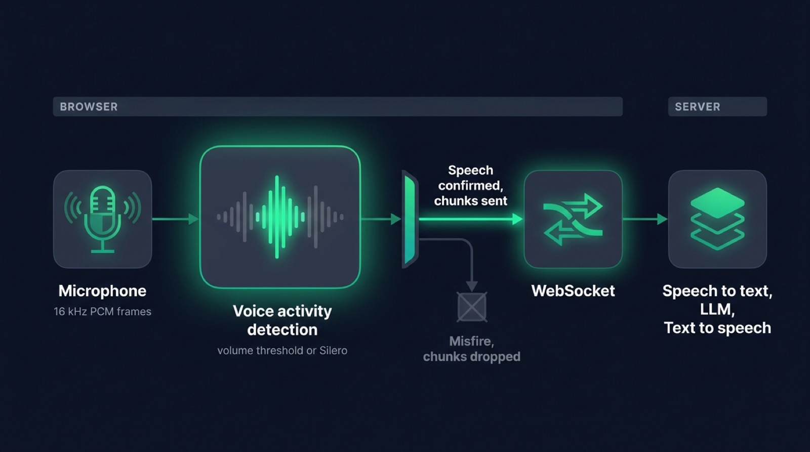

Voice activity detection (VAD) is the piece of code that decides, frame by frame, whether an audio signal carries human speech or silence. In a voice agent it runs in the browser and gates everything downstream: when to record, when to send audio to the server, when to stop the assistant mid-sentence.

Get it wrong and the symptoms are immediate. The agent answers a door slam, or it keeps listening three seconds after you finished, or it talks over you because it never noticed you started. Users read all three as a broken product, and all three happen before a single byte reaches the transcription API.

## What voice activity detection does in a voice agent

Without a VAD, the browser has two options, and both are bad. Stream the microphone continuously and you pay a transcription bill for every minute of silence while your server has no idea when a question ends. Ask the user to press and hold a button and you have a walkie-talkie rather than a conversation.

A VAD gives you the boundaries. It watches the microphone stream and emits two things worth acting on: speech started, speech ended. Everything the pipeline does hangs off those two moments.

- Recording opens when speech starts, so audio leaves the machine only while someone is talking.
- The server knows an utterance is complete when speech ends, which is its cue to transcribe and answer.
- Playback of the assistant stops the instant speech starts, which is what makes interruption possible.

In [Micdrop](/docs/client), the browser package runs the VAD locally, resamples the microphone to 16 kHz PCM and pushes chunks over a WebSocket only between those two events. The server never receives the silence.

{/* IMAGE regen: api.py image, infographic, 1600x900. Scene: "a horizontal left-to-right flow diagram of four connected modular blocks on the dark background, joined by thin glowing emerald connector arrows. All labels in English, rendered exactly as written. A small heading strip at the top left reads: BROWSER. Block 1, a stylised microphone glyph, label under it: Microphone, small caption under the label: 16 kHz PCM frames. Block 2, larger and brighter than the others, the focal point, drawn as a rounded module containing a small audio waveform where the middle segment glows emerald and the sides stay dim grey. Label under it: Voice activity detection, small caption under the label: volume threshold or Silero. Between block 2 and block 3, a vertical gate shape splits the flow into two short branches. The upper branch arrow glows emerald and is labelled: Speech confirmed, chunks sent. The lower branch arrow is dim grey, points down into a small crossed-out square, and is labelled: Misfire, chunks dropped. Block 3, a stylised bidirectional link glyph, label under it: WebSocket. Block 4, sitting under a second small heading strip at the top right that reads: SERVER. The block is drawn as three small stacked connected tiles, label under it: Speech to text, LLM, Text to speech. Flat vector geometric rendering, straight-on frontal view, even spacing between blocks, generous dark margins, all typography perfectly legible."
    Regenerate if the client pipeline stages change. Last data sync: 2026-08-13. */}


## Volume threshold, WebRTC VAD and Silero

Three approaches dominate, and they sit at very different points on the cost curve.

### The volume threshold

The cheapest VAD compares loudness against a threshold. Take the microphone stream, run it through a Web Audio `AnalyserNode`, read the frequency data, keep the loudest bin and compare it with a value in decibels. Above the line is speech, below is silence.

Micdrop's `VolumeVAD` does exactly that, with a 512-point FFT, a default threshold of -55 dBFS and a check every 100 ms. It skips the first four frequency bins, where fan noise and desk bumps live, and it requires two of the last three checks to sit above the threshold before it confirms. Those two details matter more than the algorithm itself, because a single spike stays a spike.

This works well in a quiet room, costs nothing, and needs no download. It also has no idea what speech sounds like. A dog barking, a keyboard, a colleague two desks away, all of it clears the threshold.

### WebRTC VAD

The VAD shipped inside the WebRTC stack is a Gaussian mixture model that scores six frequency bands against trained speech and noise distributions. It takes 16-bit mono PCM at 8, 16, 32 or 48 kHz, in frames of exactly 10, 20 or 30 ms, and exposes four aggressiveness modes from 0 to 3, where higher numbers reject more and skip more real speech along the way.

It is fast, tiny and battle-tested, and it is C code living in browser internals rather than an API the page can call. Using it from JavaScript means a WebAssembly build of the original module. The bigger catch is its age. It predates the modern speech models by more than a decade, and on café-level background noise it starts labelling ambient chatter as speech.

### Silero

Silero VAD is a small neural network, around 309K parameters, that reads a 512-sample frame (32 ms at 16 kHz) and returns a speech probability between 0 and 1. An LSTM state carries across frames, so the model hears context rather than isolated slices. One frame scores in under a millisecond on a single CPU thread, the weights are a couple of megabytes, the license is MIT, and the training covers a very wide range of languages.

That combination is why it became the default choice for voice agents. It separates a human voice from a television, a fan or a passing truck, which no energy threshold can do.

| Approach | What it measures | Download | Per-frame cost | Noisy room |
|---|---|---|---|---|
| Volume threshold | Loudness in dBFS | None | Negligible | Poor |
| WebRTC VAD | Six frequency bands, GMM | WASM build | Very low | Fair |
| Silero | Speech probability from a neural net | About 2 MB | Under 1 ms | Good |

## Running Silero VAD in the browser

The browser path goes through [`@ricky0123/vad-web`](https://github.com/ricky0123/vad), which wraps the Silero ONNX model and runs it with [ONNX Runtime Web](https://github.com/microsoft/onnxruntime/tree/main/js/web). Microphone audio is resampled to 16 kHz, sliced into 512-sample frames and scored by the wasm backend, off the main thread. The model and the runtime download once and sit in the browser cache afterwards.

In Micdrop that is one option:

```typescript
import { Micdrop } from '@micdrop/client'

await Micdrop.start({
  url: 'wss://your-app.com/call',
  vad: 'silero',
})
```

The interesting part is the four numbers underneath, which Micdrop exposes as constructor options:

```typescript
import { Micdrop, SileroVAD } from '@micdrop/client'

const vad = new SileroVAD({
  positiveSpeechThreshold: 0.18, // probability above which a frame counts as speech
  negativeSpeechThreshold: 0.11, // probability below which a frame counts as silence
  minSpeechFrames: 8, // frames of speech before confirming
  redemptionFrames: 20, // frames of silence before closing the utterance
})

await Micdrop.start({ url: 'wss://your-app.com/call', vad })
```

Frames are the unit, so translate them into time before tuning anything. At 32 ms per frame, 8 frames of speech is 256 ms before a confirmation, and 20 redemption frames is 640 ms of silence before the utterance closes. Those 640 ms are the single largest chunk of perceived latency you control from the browser.

The thresholds are deliberately low here. The upstream library defaults to 0.5, and Micdrop uses 0.18 because soft-spoken users get cut out at the higher value. A lower threshold buys more misfires, which the two-stage confirmation below absorbs at no cost.

<Callout type="warning" title="Serving the wasm assets">
ONNX Runtime Web needs its `.wasm` files reachable at runtime. Micdrop loads the vad-web assets from jsDelivr and the ONNX runtime from unpkg, because the runtime's `dist` folder exceeds the jsDelivr size limit and every file 404s from there. Self-host both if you would rather keep the call free of third-party requests.
</Callout>

## Tuning latency, false positives and background noise

Every VAD setting trades one failure for another. Raise the threshold and you stop reacting to the air conditioning, and you also stop hearing a quiet user. Shorten the silence window and the agent feels snappy right up to the moment it interrupts someone drawing breath.

Two mechanisms make that trade less painful, and both live in how the events are wired rather than in the model.

Confirming in two stages is the first. Micdrop's VADs emit `StartSpeaking` for a maybe, then either `ConfirmSpeaking` or `CancelSpeaking`. Recording begins on the maybe, and the resulting chunks are queued in memory instead of being sent. If the confirmation arrives, the queue flushes to the server with the first syllable intact. If the cancellation arrives, the queue is dropped and nothing ever left the machine. A false positive costs a few kilobytes of RAM.

Delaying the recorded stream is the second, and it exists because detection always lags the sound that triggered it. A volume VAD checking every 100 ms notices the word 100 ms after it started, and by then the attack of the word is gone. Micdrop routes the recorded audio through a Web Audio `DelayNode` set to the detection interval, so what gets captured starts slightly before the moment of detection. Words keep their first consonant.

You can also run two detectors at once, which is the setting worth trying when a single one keeps disappointing:

```typescript
await Micdrop.start({
  url: 'wss://your-app.com/call',
  vad: ['volume', 'silero'],
})
```

The combination emits a maybe as soon as either detector fires, and confirms only when both agree. The volume threshold filters out distant voices that are too quiet to be aimed at the microphone, Silero filters out everything loud that is not human. The full option surface for both lives in the [VAD documentation](/docs/client/vad).

## VAD and interruptions

Barge-in is the feature that separates a conversation from a menu system, and the VAD is the only component in a position to deliver it. While the assistant is talking, the transcription pipeline has nothing to work with. Something has to be listening to raw microphone audio and willing to act on it within a few hundred milliseconds.

In Micdrop the browser handles it without a server round trip. The moment speech is confirmed, playback stops locally, the processing state is cleared, and a message goes out telling the server to abandon the answer it was streaming. The cut lands immediately because it happens on the same machine as the ear that heard it.

The failure mode here is echo. If the assistant's voice reaches the microphone through the speakers, the VAD hears speech and interrupts the agent with its own words, on loop. Micdrop asks `getUserMedia` for `echoCancellation` and `noiseSuppression`, which handles most laptop and phone setups. Loud external speakers can still defeat it, and headphones remain the reliable answer for a demo you cannot afford to have fail.

## Where VAD stops and turn detection starts

A VAD reports acoustics. It tells you sound stopped, and it has no opinion about whether the sentence was finished. Those two questions differ more than they look:

> "I'd like to book a flight to..."

The speaker paused to remember the city. Acoustically, this is a completed utterance with 700 ms of silence behind it, and any VAD tuned for responsiveness will close it. The agent then answers a half-question, and the user has to start over.

Longer silence windows push the problem around rather than solving it. Two seconds of tolerance for mid-sentence pauses makes every normal exchange feel two seconds slow.

The fix lives one layer up, on the transcript rather than on the waveform. [Semantic turn detection](/docs/server/semantic-turn-detection) asks whether the text so far is a complete thought, and holds the answer back when it is not. Micdrop implements it as an agent option that emits a `SkipAnswer` event on an incomplete sentence:

```typescript
const agent = new OpenaiAgent({
  apiKey: process.env.OPENAI_API_KEY || '',
  systemPrompt: 'You are a helpful assistant',
  autoSemanticTurn: true, // wait for a complete thought
  autoIgnoreUserNoise: true, // drop "uh", "hmm", "ahem"
})
```

The second option covers the other half of the problem. A VAD correctly identifies "hmm" as speech, because it is, and answering it wastes a full round trip. [Noise filtering](/docs/server/noise-filtering) drops those interjections before the agent replies to them.

Divide the responsibilities this way and each layer does what it is good at. The VAD decides when the microphone is worth recording, and the language model decides when the user is done talking.

## Frequently asked questions

<FaqList>
  <FaqItem question="What is VAD?">
    VAD stands for voice activity detection. It is the process of classifying short frames of audio as speech or non-speech, usually every 10 to 32 milliseconds. Voice agents use it to know when to start recording, when an utterance has ended, and when the user is interrupting the assistant.
  </FaqItem>
  <FaqItem question="Does voice activity detection run offline in the browser?">
    Yes. A volume-based VAD uses the Web Audio API and needs no network at all. A Silero VAD downloads a model of about 2 MB plus the ONNX Runtime Web wasm files on first load, then runs entirely on the CPU of the device. No audio is sent anywhere for detection, which also means the microphone stream stays local until speech is actually detected.
  </FaqItem>
  <FaqItem question="What is the difference between VAD and turn detection?">
    A VAD works on the audio signal and answers "is someone speaking right now". Turn detection works on the transcript and answers "has this person finished their thought". A VAD closes an utterance after a fixed amount of silence, so it cuts off a user who pauses mid-sentence. Turn detection reads the words and waits, which is why voice agents run both.
  </FaqItem>
</FaqList>

## Getting started

Voice activity detection is the least glamorous part of a voice agent and the one users feel first. A threshold that is too high loses quiet speakers, a silence window that is too long makes every answer feel sluggish, and a missing interruption path makes the agent feel deaf.

Micdrop ships both detectors, the two-stage confirmation and the interruption path in the browser package:

```bash
npm install @micdrop/client @micdrop/server
```

The [VAD documentation](/docs/client/vad) covers every option, the combination modes and a React settings panel to tune them live. The [Getting Started guide](/docs/getting-started) gets a working call running in about five minutes.
